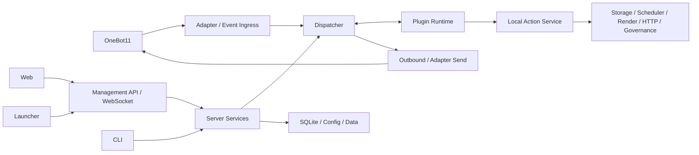

# RayleaBot 项目章程

RayleaBot 是面向个人开发者、自用机器人部署者和开源协作者的自托管聊天机器人框架。本章程定义长期产品目标、系统边界和工程原则；接口字段、状态和错误语义以 `contracts/` 为准，版本交付范围以最新 execution plan 为准。

## 产品使命

RayleaBot 为聊天平台事件处理、插件扩展和本地管理提供一套可验证、可恢复、可维护的运行平台：

- 数据、凭据和运行状态由用户自主管理；
- 日常部署和运维不依赖云端控制面；
- 插件通过版本化协议访问受控平台能力；
- Web、Launcher 和 CLI 共享服务端状态与错误模型；
- 正式发行物具有可验证的来源、完整性和恢复路径。

## 正式边界

### 平台范围

- OneBot11 是正式聊天协议，覆盖 `reverse_ws`、`forward_ws`、`http_api` 和 `webhook`。
- Server 负责事件、状态、插件、任务、调度、渲染、治理、日志和恢复。
- Python 与 Node.js 是正式插件运行时。
- Web 是主要在线管理面；Launcher 负责本机进程编排、预检、更新检查和 Windows 事务安装；CLI 负责离线或脚本化运维。
- SQLite 是单实例状态库；用户配置、持久状态、缓存、日志、模板和插件目录具有明确职责。

### 非目标

- 多实例、分布式和高可用部署；
- 正式插件市场和远程分发平台；
- 插件间依赖解析；
- 插件 OS 强沙盒或对不可信本地代码的隔离承诺；
- Rust、Go 等额外官方托管插件运行时；
- 非 OneBot 多协议扩展；
- 微前端、远程组件运行时或第二套状态模型。

第三方插件是用户检查来源、摘要、能力和安装脚本后确认执行的完全可信本地代码。

## 设计原则

- **Contract-first**：HTTP、WebSocket、schema、错误码、事件、插件协议、CLI 和 release metadata 由 `contracts/` 裁决。
- **Single source of truth**：Server 是在线状态源；客户端不从日志、本地缓存或重复模型推断正式状态。
- **Thin clients**：Web 和 Launcher 只承担交互、系统集成与本机编排，不复制服务端业务逻辑。
- **Trust boundaries are explicit**：浏览器会话、Launcher control、插件代码和发布更新各自具有独立信任根与拒绝策略。
- **Transactional state changes**：安装、升级、恢复和调度变更必须具有原子边界、可追溯终态和失败恢复。
- **Bounded resources**：队列、HTTP 响应、下载、归档、展开文件和插件包均有硬上限。
- **Frozen stack**：Go、Vue、React、Electron 和 SQLite 是正式技术栈；依赖只在单一版本线内维护。
- **Evidence-based quality**：测试覆盖真实风险；性能优化以 benchmark、trace 或 profile 为依据。

## 顶层架构

| 领域 | Owner | 正式状态源 |
| --- | --- | --- |
| 对外接口与发布元数据 | `contracts/` | formal contracts 与 fixtures |
| 在线业务与运行状态 | Server | SQLite、配置快照与受保护的内存状态 |
| 插件声明 | Plugin Catalog | 已校验 manifest、管理页入口与安装来源 |
| 插件进程状态 | Runtime Manager | runtime snapshot |
| 桌面进程与安装事务 | Launcher / external updater | server 状态与 updater journal |
| 客户端展示 | Web / Launcher | 管理 API 与 WebSocket 投影 |

平台分层、信任边界和状态 owner 见 [Architecture Docs](./architecture/README.md)。

## 产品质量

正式版本应满足：

- 默认 loopback，远程管理需要显式公开 origin、可信代理和 HTTPS；
- 浏览器使用 HttpOnly cookie、CSRF 和 WebSocket Origin 校验；
- 管理操作具有结构化错误、任务终态和可诊断日志；
- 插件安装、启停、重载、卸载和管理页动作可追溯；
- 备份、恢复、doctor、healthz、readyz 和 rollback 构成完整恢复路径；
- Web 与 Launcher 达到 WCAG 2.2 AA，并覆盖正式最小视口；
- 发行物包含许可证、第三方 notices、签名 metadata 和可重复 smoke；
- Windows 自动安装同时通过 Ed25519 与正式 Authenticode，并在失败时恢复旧版和旧状态。

## 演进规则

1. 冻结 contract、错误语义和兼容边界。
2. 补齐 valid/invalid fixtures、generated types 和 SDK。
3. 实现 server 的状态、并发、资源和持久化语义。
4. 接入 Web、Launcher、CLI 与插件运行时。
5. 通过风险对应的测试、发布 smoke、恢复 drill 和文档验收。

需要新状态源、信任根、运行时或部署模型的能力必须单独设计，不作为现有模块的隐式扩展。

## 文档入口

| 目录 | 内容 |
| --- | --- |
| [`architecture/`](./architecture/README.md) | 组件 owner、信任边界、状态源和运行链路 |
| [`engineering/`](./engineering/README.md) | 工具链、实施顺序、质量门禁和存储治理 |
| [`plugin/`](./plugin/README.md) | manifest、capabilities、自定义管理页、协议、生命周期和 SDK |
| [`user/`](./user/README.md) | 部署、配置、管理、CLI 与恢复 |
| [`release/`](./release/README.md) | 发布信任、产物、更新、回滚与验收 |
| [`dev/`](./dev/README.md) | 仓库协作、诊断和文本资源 |

当前实施状态见 [`execution-plan-v0.3.md`](./execution-plan-v0.3.md)，已发布版本记录见 [`CHANGELOGS/`](./CHANGELOGS/)。固定版本线见 [`engineering/baseline.md`](./engineering/baseline.md)。
