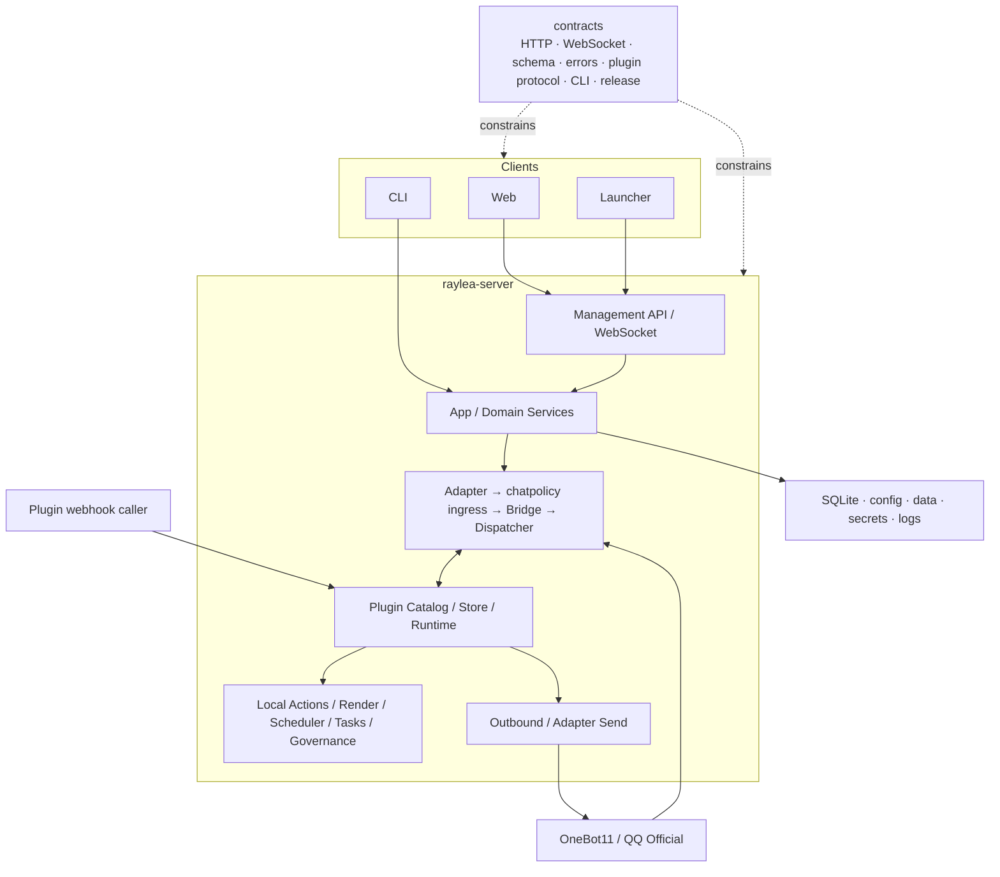
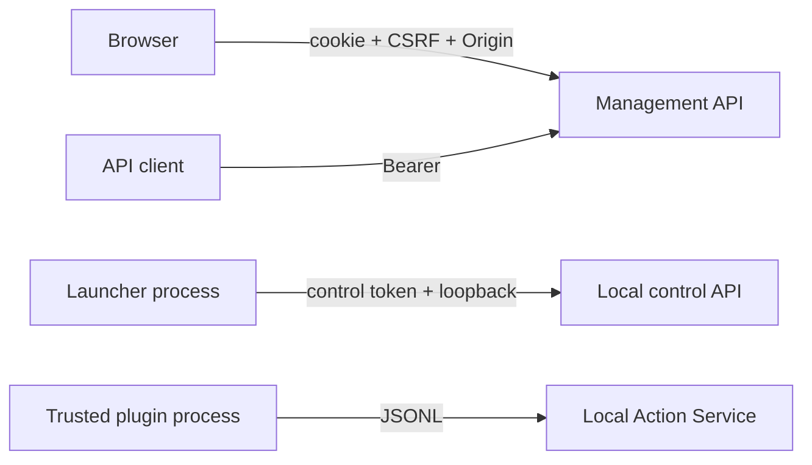
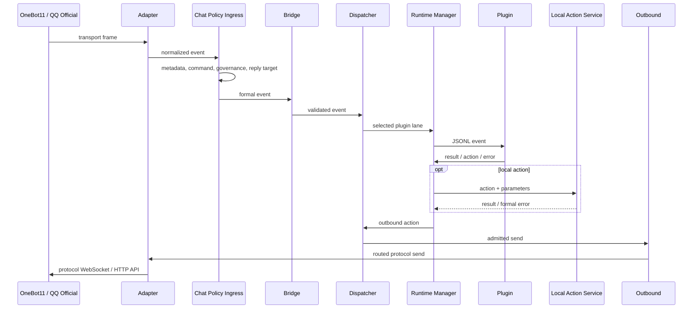
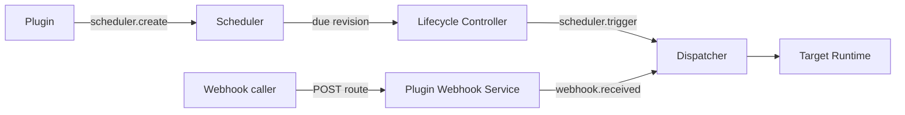

# Architecture Overview

本页概述 RayleaBot 的组件职责、消息主流程和状态归属。字段、状态、错误码和协议结构以 `contracts/` 为准；插件协议与生命周期见[插件文档](../plugin/README.md)，发布与更新策略见 [Delivery and Upgrade](../release/delivery-and-upgrade.md)。

## 总览

## 组件职责

| 组件 | 职责 | 禁止承担 |
| --- | --- | --- |
| App | 服务组装、启动、关闭和领域服务协调；启动前获取 `<config-path>.runtime.lock`，关闭按依赖逆序释放资源 | 把内部对象暴露给客户端 |
| Management handlers | transport、鉴权、参数校验和错误映射；只向客户端返回稳定 `code` 与安全 `message` | 业务状态机和 runtime / storage 内部模型 |
| Config | 配置读取、schema 校验、运行快照与需重启字段 | 让插件或客户端直接写配置文件 |
| Adapter | OneBot11 与 QQ 官方的实例启停、transport、鉴权、归一化和动作转换 | 业务持久化和插件治理 |
| Chat Policy Ingress | 元数据补齐、按插件生效前缀的命令解析与目标确定、黑白名单、命令权限、冷却和 reply target | 插件进程管理或治理数据突变 |
| Bridge | 统一事件结构校验与观测 | 平台内部事件的重复转发层 |
| Message Statistics | 入口收信、确认发送的小时计数，连接离线与服务运行记录，按有效时区生成查询视图 | 从日志反推计数或让客户端累计业务状态 |
| Dispatcher | 按 Ingress 确定的命令目标或事件订阅选择插件、按会话 lane 排队、优先级分层和出站动作执行 | 直接访问插件私有存储；脱离前缀按命令名重新匹配 |
| Runtime Manager | 插件子进程、JSONL、握手、保活、事件 session、本地动作 RPC，以及插件间服务调用的路由与期限 | 直接执行平台能力；解释服务的业务参数或决定调用许可 |
| Plugin Lifecycle Controller | 发现、启停、重载、崩溃恢复，以及安装与卸载事务协调 | 绕过按插件串行的操作门 |
| Local Action Service | 本地动作参数校验与平台能力网关 | 绕过正式 action contract |
| Plugin Store Service | 官方与自定义目录来源、缓存与安装委托 | 绕过统一安装事务或持有插件运行状态 |
| Plugin Webhook Service | webhook 路由注册、来源与正文上限检查和事件投递 | 替插件验签或去重 |
| Task Registry | 后台任务 admission、执行状态、有序持久化和关闭 drain | 为队列已满请求创建 pending task |
| Scheduler | cron revision、到期检查和插件事件触发 | 直接发送聊天消息 |
| Render Service | 模板校验与同步、Chromium、artifact、资源摘要与缓存 | 插件自建并行截图链路 |
| Browser Manager | 插件专属托管浏览器会话、profile 与 CDP 端点 | 跨插件共享 profile |
| Deps Service | Chromium 与 FFmpeg 资源准备和诊断快照 | 插件重复打包运行时 |
| Launcher | 本机进程、预检、更新检查与一键更新编排 | 在线业务状态或 Web 页面复制 |

## 信任边界

| 边界 | 接受条件 | 拒绝条件 |
| --- | --- | --- |
| 浏览器管理 | 合法请求地址与同源 Origin、cookie 会话、unsafe method CSRF | query token、跨站请求、伪造 Host、错误 Origin |
| 初始化 | 一次性 setup token、JSON、Fetch Metadata | token 缺失或复用、跨站表单、非法 Host |
| Launcher 控制 | loopback 直连与进程级 control token | 无凭据 shutdown、代理转发来源 |
| 插件代码 | 用户检查来源、目标平台和 artifact 摘要后确认 | 未确认安装、非法包路径、摘要不一致 |

第三方插件是管理员确认安装的完全可信本地代码。宿主动作不按插件声明授权，平台也不提供 OS 安全沙盒；插件可以自行访问网络、读写 `RAYLEABOT_PLUGIN_DATA_DIR` 并启动随包辅助程序，但不能绕过 Local Action Service 修改宿主配置、secret 或状态库，也不能绕过 Dispatcher 发送聊天消息。

## 消息主流程

- 同一 `event.target` lane 保持 FIFO，不同目标在插件并发度内并行；队列满时丢弃该次投递并计入观测摘要。
- 插件以 `event.detach` 把消息、计划任务触发或管理动作事件转入后台时，Runtime 以转入结果完成投递，Dispatcher 随即释放 lane 与并发槽；事件 session 留在 Runtime Manager，直到终态、后台期限或进程停止，计划任务的结果在事件真正结束时记录。
- 命令声明优先选择目标插件，其余事件按订阅匹配。消息候选按 manifest `priority` 分层，同层并发；成功终态的 `propagation` 覆盖静态 `block`，未处理、失败和队列拒绝继续后续层。
- Ingress 先匹配会话等待；命中后只执行名单准入，并把回复定向交给登记进程。
- 本地动作使用独立 `request_id` 并以 `parent_request_id` 关联事件，返回正式 result 或 error；插件私有日志、配置、KV 与会话动作按插件 ID 隔离。
- Dispatcher 是插件出站动作的唯一执行出口；Outbound 按目标 admission 与限流后发送一次，发送失败返回正式错误，不自动重试。冷却提示、内置菜单和调度消息共用这条链路；冷却提示只在目标当下有额度时发送，不排队，并按 `user.cooldown_reply_once` 限制同一用户在同一会话每个冷却期最多一次。

Scheduler 以插件 ID、任务 ID 和 revision 维护单一 mutation path，只投递 `scheduler.trigger`。Plugin Webhook Service 按 route 找到目标插件，检查来源与正文上限后投递 `webhook.received`。`config.changed`、`bot.identities.changed` 与 `management.action` 等平台内部事件同样按目标直接进入 Dispatcher，不经过 Bridge。

## 状态归属

| 领域 | 职责方 | 正式状态来源 | 消费者 |
| --- | --- | --- | --- |
| 对外接口与发布元数据 | `contracts/` | schema、OpenAPI、WebSocket、errors、CLI、fixtures | 所有实现与文档 |
| 服务生命周期与运行状态 | App / domain services | SQLite、配置快照、受保护内存状态 | API、CLI、Launcher |
| 消息统计与中断历史 | Message Statistics | SQLite 小时计数、最近收信时间、运行与离线区间，以及锁保护的待写增量；不自动清理 | 管理 API |
| 聊天适配器连接与事件 | Adapter / Event Pipeline | 按实例隔离的 adapter snapshot 与统一事件 | Dispatcher、协议管理面 |
| 插件声明、启用意图与管理投影 | Plugin Catalog | 校验后的 manifest、管理页入口、安装来源与用户意图 | Lifecycle、管理面 |
| 插件进程与事件 session | Runtime Manager / Registry | 当前、待发布及退出中的 runtime snapshot；未完成的服务调用登记在调用方与提供者各自的事件 session 上；后台事件的期限与结束 | Lifecycle；Dispatcher 读取投递就绪状态与后台事件的结束 |
| 投递许可、队列与排空 | Dispatcher | 接收事件时确定的目标实例与 lane | Runtime Manager、观测摘要 |
| 对话路由与期限 | `bot/conversation` | 完整聊天身份、等待登记、父事件与具体进程 | Ingress、Runtime Manager |
| 插件商店目录 | Plugin Store Service | HTTPS 来源的已校验目录、来源元数据与刷新状态 | 安装流程、管理面 |
| 插件浏览器会话 | Browser Manager | 插件专属托管浏览器进程、profile 与 CDP 端点 | Local Action、插件 |
| 后台任务 | Task Registry | 有序持久化记录与终态 | API、WebSocket、恢复逻辑 |
| 调度任务 | Scheduler | SQLite job 与内存 revision | 插件定向事件 |
| 图片渲染 | Render Service | 模板仓、artifact 与缓存元数据 | Local Action、管理面 |
| Chromium 与 FFmpeg 资源 | Deps Service | `.deps/manifest.json`、准备目录与诊断快照 | 渲染、浏览器会话、插件媒体处理、系统诊断 |
| 客户端视图 | Web / Launcher | API 与 WebSocket 的临时视图 | 用户 |

Web 和 Launcher 只保存可丢弃的临时视图，不能反向覆盖服务端。插件、任务和适配器的状态枚举以 `contracts/web-api.openapi.yaml` 与 `contracts/websocket-events.yaml` 为准，插件状态含义见[插件生命周期](../plugin/lifecycle.md#插件状态)。

| 资源 | 职责方 | 语义 |
| --- | --- | --- |
| 内嵌 schema 默认值、`config/user.yaml` | Config | 校验后合并为运行快照 |
| SQLite | Server services | auth、tasks、plugins、scheduler、logs 等正式状态 |
| `data/plugins/<plugin_id>/` | 插件进程 | 插件数据目录，经 `RAYLEABOT_PLUGIN_DATA_DIR` 传入；artifact 升级不覆盖 |
| `plugins/installed/` | Plugin Catalog | 经校验的插件 artifact、后端二进制与管理页资源 |
| `templates/` | Render Service | 模板版本与资源 |
| `data/render/` | Render Service | 最终图片及 artifact 索引；实际位置跟随数据库所在目录 |
| `cache/` | 各自归属 | 可重建缓存，不影响正确性 |
| `cache/render/` | Render Service 与渲染动作 | 预取资源、临时 HTML 与 Chromium 临时文件；请求文件在渲染后清理，自建 profile 在浏览器关闭后清理 |
| `cache/browser/` | Browser Manager | 本地浏览器会话的临时 profile、进程临时文件与启动日志；会话关闭后清理 |
| `cache/launcher/webview2/` | Launcher | Windows WebView2 页面缓存与浏览器资料，开发二进制更名时复用同一目录 |
| `logs/` | Logging | 结构化日志与诊断输出 |
| `.deps/` | Deps Service | Chromium 与 FFmpeg / FFprobe 受控资源 |

## 部署与演进边界

`raylea-server` 在 Server 模式提供 HTTP/WebSocket、事件链和插件子系统，在 CLI 模式复用同一领域服务执行诊断、备份、恢复、更新检查与更新安装。Launcher 以子进程托管 Server，并通过独立 control token 管理本机进程。单实例与本地 SQLite 是正式部署模型。

以下方向需要新的 contract、状态一致性说明和验证矩阵，不能作为日常修补隐式进入主流程：

- 多实例、高可用与远程状态库；
- 插件 OS 强沙盒；
- OneBot11 与 QQ 官方之外的聊天协议；
- 新的官方插件运行时；
- 新的客户端状态来源或远程组件运行时。
