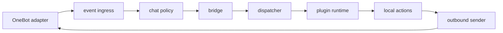

# Event Pipeline

RayleaBot event flow is a single pipeline:

## Stages

| Stage | Input | Output | Failure owner |
| --- | --- | --- | --- |
| Adapter | OneBot transport frame | normalized event metadata | adapter transport |
| Event ingress | normalized event | command candidate or ignored event | ingress policy |
| Chat policy | command candidate | allowed command or rejected reply | governance policy |
| Bridge | allowed event | validated runtime event | bridge validation |
| Dispatcher | runtime event | plugin deliveries | dispatcher queue |
| Plugin runtime | plugin delivery | plugin response or local action request | runtime manager |
| Local actions | local action request | platform capability result | action module |
| Outbound | reply action | OneBot send call | adapter outbound |

## Boundaries

- Adapter code owns transport parsing and send calls only.
- Event ingress owns command extraction, reply target capture, cooldown checks, and ready coordination.
- Governance owns blacklist, whitelist, command policy, and policy change events.
- Bridge owns normalized event validation and bridge-level observability.
- Dispatcher owns target selection, fan-out, queueing, plugin command refresh, and plugin action dispatch.
- Runtime manager owns plugin process lifecycle, handshakes, pings, crashes, and pending event sessions.
- Local action service owns platform capabilities exposed to plugins.

## Diagnostics

- Each management task and WebSocket event includes stable status fields from `contracts/`.
- Dispatcher failures are attributed to queueing, runtime delivery, plugin response, or outbound send.
- Runtime failures are represented through plugin runtime state, task state, and dead-letter summaries.
- System diagnostics export the current status, readiness, recovery summary, logs, and runtime snapshots.
