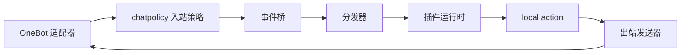

# Event Pipeline

RayleaBot 的事件流遵循单一管线：

```mermaid
flowchart LR
  Adapter["OneBot 适配器"] --> Policy["chatpolicy 入站策略"]
  Policy --> Bridge["事件桥"]
  Bridge --> Dispatch["分发器"]
  Dispatch --> Runtime["插件运行时"]
  Runtime --> Actions["local action"]
  Actions --> Outbound["出站发送器"]
  Outbound --> Adapter
```

## 处理阶段

| 阶段 | 输入 | 输出 | 失败归属 |
| --- | --- | --- | --- |
| Adapter | OneBot 传输帧 | 归一化事件元数据 | adapter transport |
| Chat policy ingress | 归一化事件 | 允许事件、忽略事件或冷却提示 | `eventpipeline/chatpolicy` |
| Bridge | 允许事件 | 已校验的运行时事件 | bridge validation |
| Dispatcher | 运行时事件 | 插件投递 | dispatcher queue |
| Plugin runtime | 插件投递 | 插件响应或 local action 请求 | runtime manager |
| Local actions | local action 请求 | 平台能力结果 | action module |
| Outbound | 回复动作 | OneBot 发送调用 | adapter outbound |

## 边界

- Adapter 只负责传输解析和发送调用。
- `eventpipeline/chatpolicy` 负责 adapter ingress、命令提取、回复目标捕获、黑白名单、权限、冷却检查和 ready 协调。
- `governance` 负责管理侧黑名单、白名单、命令策略变更及其事件，不负责入站策略失败。
- Bridge 负责归一化事件校验和 bridge 层可观测性。
- Dispatcher 负责目标选择、扇出、排队、插件命令刷新和插件 action 分发。
- Runtime Manager 负责插件进程生命周期、握手、ping、崩溃和待处理事件会话。
- Local Action Service 负责向插件暴露平台能力。

## 诊断

- 每个管理任务和 WebSocket 事件都包含来自 `contracts/` 的稳定状态字段。
- Dispatcher 失败归因于排队、运行时投递、插件响应或出站发送。
- 运行时失败通过插件运行状态、任务状态和 dead-letter 摘要表达。
- 系统诊断输出当前状态、就绪状态、恢复摘要、日志和运行时快照。
