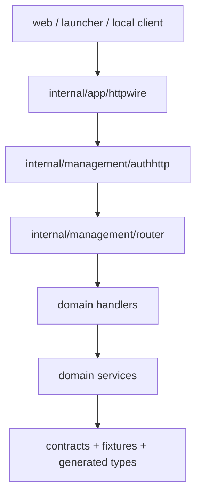

# Management API

管理 API 是 Web、Launcher 和本地运维入口共同使用的服务端边界。正式字段、错误码和 schema 以 `contracts/web-api.openapi.yaml` 为准。

## 调用链



`internal/app/httpwire` 只负责统一中间件、鉴权接入和 handler 注册。各领域 handler 只返回管理 API 视图，不直接暴露 runtime、storage 或 provider 的内部模型。

## 错误响应

错误响应使用统一 envelope：

```json
{
  "error": {
    "code": "platform.invalid_request",
    "message": "请求参数不合法",
    "message_key": "errors.platform.invalid_request",
    "request_id": "req_..."
  }
}
```

handler 只能向客户端返回稳定 `code` 和安全 `message`。底层 cause 写入日志，不进入响应体。错误码必须存在于 `contracts/error-codes.yaml`。

## 同步检查

- `scripts/ci/validate_contracts.py --mode=strict` 校验 OpenAPI、fixtures、配置 metadata 和生成物。
- `server/tests/architecture/error_codes_test.go` 校验 management handler 使用的错误码。
- `server/tests/architecture/credential_leak_test.go` 防止扫码登录成功响应 fixture 带出原始凭据。
- Web 和 Launcher 生成类型来自 `contracts/web-api.openapi.yaml`，contract 变更需要同步生成物。
