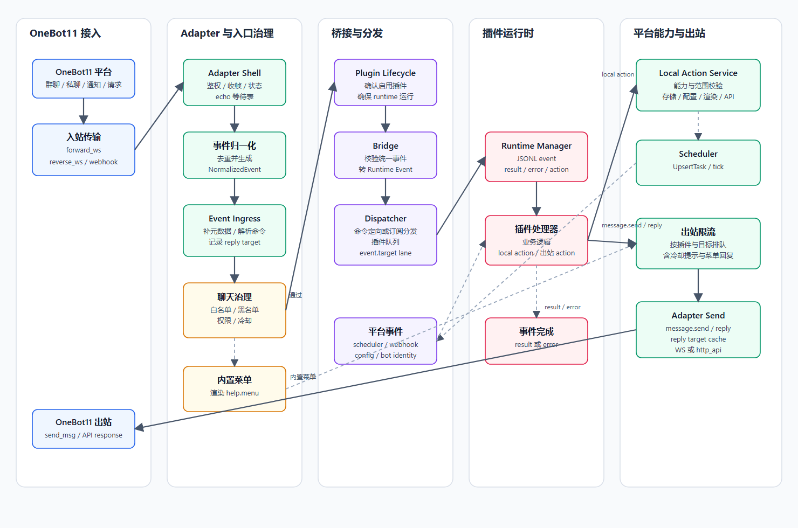
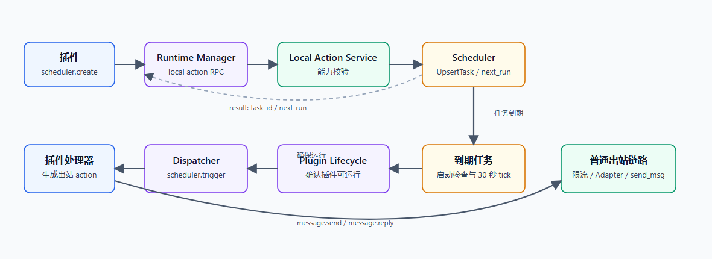

# Message Flow

本文档说明 RayleaBot 从消息入站到出站发送的当前处理链路，覆盖 OneBot11 入站、插件分发、插件动作、出站限流、定时触发和插件 Webhook 入口。

正式事件名、action 名、字段结构和错误码以 `contracts/` 为准。

## 总览

## 入站链路

OneBot11 入站支持 `forward_ws`、`reverse_ws` 和 `webhook`。Adapter 负责传输鉴权、协议帧分类、状态快照、事件去重和事件队列。

入站事件进入 Event Ingress 后，会完成以下处理：

- 补齐群、用户、bot 身份等可用元数据。
- 记录 reply target，用于后续 `message.reply` 定位原消息。
- 按当前命令前缀解析 `payload.command` 和 `payload.args`。
- 执行聊天治理：白名单、黑名单、命令权限和命令冷却。
- 内置菜单命令由平台直接渲染并发送。
- 普通事件进入 Bridge 和 Dispatcher。

Bridge 只接收正式支持的统一事件。无法识别、缺少必要字段、没有可投递插件或没有订阅目标的事件会被忽略并进入观测摘要。

## 插件分发

Dispatcher 只向 `running` 状态的插件投递事件。

命令消息优先匹配插件 manifest 或动态配置中声明的命令；有匹配项时事件定向给对应插件。没有命令匹配时，事件按插件订阅的 `event_type` 分发，订阅 `*` 的插件接收全部正式事件。

每个插件拥有独立事件队列。队列内按 `event.target` 划分 lane；同一目标保持 FIFO，不同目标在插件并发度内并发处理。队列满时事件丢弃并记录。

Runtime Manager 通过 JSONL 协议向插件进程发送 `event`，并等待插件返回 `result`、`error` 或出站 `action`。插件可以在事件处理期间发起 local action；local action 必须使用独立 `request_id`，并通过 `parent_request_id` 归属到当前事件。

## 出站链路

插件返回 `message.send` 或 `message.reply` 时，Dispatcher 是唯一执行出口。

出站发送包含以下固定约束：

- action 必须通过插件能力授权。
- 平台按插件和目标执行出站限流。
- `message.reply` 通过 reply target cache 定位原消息和会话。
- 出站消息段由 Adapter 投影为 OneBot11 `send_msg` 参数。
- WebSocket 已连接时通过 `forward_ws` 或 `reverse_ws` 发送并等待 echo 响应。
- WebSocket 不可用时使用配置好的 `http_api` 发送。
- 发送结果、失败原因、目标、消息摘要和插件上下文进入结构化日志。

冷却提示和内置菜单回复复用同一套出站限流与 Adapter 发送链路。

## 定时消息链路

定时任务由插件通过 `scheduler.create` 注册。该 action 需要 `scheduler.create` 能力授权。

Scheduler 使用插件 ID 和 `task_id` 做幂等更新，任务保存到 SQLite，并计算下一次触发时间。服务启动后会检查一次到期任务，运行期间每 30 秒检查一次。

任务到期时，Plugin Lifecycle Controller 会确认目标插件仍然存在、有效、已安装并处于启用状态；插件未运行时会尝试启动。符合条件的任务会变成 `scheduler.trigger` 平台事件，并通过 `DispatchToPlugin` 投递给目标插件。

定时消息发送由插件在处理 `scheduler.trigger` 时发起 `message.send` 或 `message.reply`，后续路径与普通插件出站完全一致。

## 其他平台事件

以下事件不来自 OneBot11 Bridge，而是平台内部直接定向投递到 Dispatcher：

| 事件 | 来源 | 投递方式 |
| --- | --- | --- |
| `scheduler.trigger` | Scheduler 到期任务 | 按 job 的 `plugin_id` 定向投递 |
| `webhook.received` | 插件暴露的 HTTP webhook | 鉴权后投递给注册该 route 的插件 |
| `config.changed` | 插件配置变更 | 投递给对应插件 |
| `bot.identity.changed` | OneBot bot 身份可用或变化 | 投递给已注册运行时的插件 |

这些事件仍使用 Runtime Manager、插件队列、local action 和出站发送链路。

## 关键边界

- Adapter 只处理协议接入、归一化、状态和 OneBot API 调用。
- Event Ingress 是聊天治理和命令解析入口。
- Bridge 只处理 OneBot11 归一化事件，平台内部事件可直接进入 Dispatcher。
- Dispatcher 是插件事件排队和插件出站 action 执行出口。
- Runtime Manager 只负责插件进程协议，不直接访问平台能力。
- Local Action Service 是插件访问配置、存储、渲染、调度、Webhook 和 OneBot 扩展动作的正式入口。
- Scheduler 不直接发送聊天消息，只触发插件事件。
