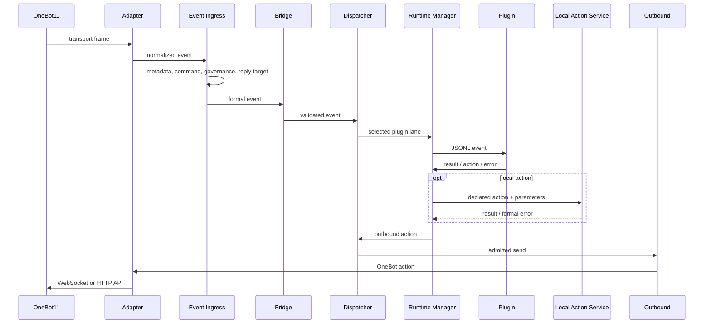
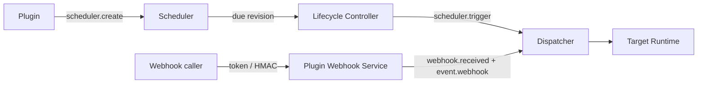

# Message Flow

本文档说明 OneBot11 入站、插件分发、平台 action、出站发送、调度和 webhook 的正式运行链路。事件与 action 字段以 `contracts/` 为准。

## 消息主链

```mermaid
sequenceDiagram
    participant OB as OneBot11
    participant AD as Adapter
    participant IN as Event Ingress
    participant BR as Bridge
    participant DP as Dispatcher
    participant RT as Runtime Manager
    participant PL as Plugin
    participant LA as Local Action Service
    participant OUT as Outbound

    OB->>AD: transport frame
    AD->>IN: normalized event
    IN->>IN: metadata, command, governance, reply target
    IN->>BR: formal event
    BR->>DP: validated event
    DP->>RT: selected plugin lane
    RT->>PL: JSONL event
    PL->>RT: result / action / error
    opt local action
        RT->>LA: declared action + parameters
        LA-->>RT: result / formal error
    end
    RT->>DP: outbound action
    DP->>OUT: admitted send
    OUT->>AD: OneBot action
    AD->>OB: WebSocket or HTTP API
```

### Owner

| 环节 | Owner | 状态源 |
| --- | --- | --- |
| transport 与协议帧 | Adapter | connection snapshot、echo waiters、dedupe state |
| 命令与聊天治理 | Event Ingress | 配置与治理服务 |
| 统一事件校验 | Bridge | formal event contract |
| 目标与队列 | Dispatcher | manifest subscriptions、command declarations、per-plugin lanes |
| 插件进程协议 | Runtime Manager | runtime snapshot 与 event session |
| 平台 action | Local Action Service | capability declarations 与领域服务 |
| 出站限流与发送 | Outbound / Adapter | rate limit、reply target、transport snapshot |

同一 `event.target` lane 保持 FIFO；不同目标可在插件并发度内并行。队列满时必须返回或记录正式拒绝结果，不能产生无 owner 的 pending 状态。

## 入站语义

Adapter 负责 transport 鉴权、协议帧分类、连接状态、事件去重和 OneBot11 字段归一化。Event Ingress 补齐可用的 bot、用户、群和 reply target 元数据，解析命令，并执行白名单、黑名单、命令权限与冷却裁决。

Bridge 只处理 OneBot11 归一化事件。无法通过正式结构校验的事件进入结构化诊断，不交给插件。

Dispatcher 只向可投递的 runtime 发送事件。命令声明优先选择目标插件，其余事件按 `event_type` 订阅匹配。

## 插件动作

插件通过 Runtime Manager 发起 local action。每个 action 必须：

- 使用独立 `request_id`，并通过 `parent_request_id` 关联当前事件；
- 在 manifest 中声明对应 capability；
- 满足 capability 参数和资源上限；
- 返回正式 result 或 error envelope。

Runtime Manager 不直接访问存储、HTTP、渲染、调度、治理或 OneBot provider；这些能力由 Local Action Service 统一执行。

## 出站语义

插件返回 `message.send` 或 `message.reply` 后，Dispatcher 是唯一执行出口。Outbound 按插件和目标执行 admission、限流、冷却与受控重试。Adapter Send 把消息段投影为 OneBot11 `send_msg` 参数；WebSocket 可用时等待 echo，无法使用时按配置回退到 `http_api`。

冷却提示、内置菜单和调度消息共享同一条 Outbound 与 Adapter Send 链路。

## 调度与 webhook

```mermaid
flowchart LR
    P["Plugin"] -->|"scheduler.create"| S["Scheduler"]
    S -->|"due revision"| LC["Lifecycle Controller"]
    LC -->|"scheduler.trigger"| D["Dispatcher"]
    D --> R["Target Runtime"]

    H["Webhook caller"] -->|"token / HMAC"| WH["Plugin Webhook Service"]
    WH -->|"webhook.received + event.webhook"| D
```

Scheduler 以插件 ID、任务 ID 和 revision 维护单一串行 mutation path。旧 trigger 不能覆盖或复活更新后的 job。Scheduler 只投递 `scheduler.trigger`，消息仍由插件通过正式出站 action 发送。

Plugin Webhook Service 验证 route、token/HMAC 和目标插件后，构造 `event.webhook` typed metadata，其中 `route` 与 `received_at` 必填。Webhook 事件定向进入 Dispatcher，不经过 OneBot11 Bridge。

其他平台内部事件如 `config.changed`、`bot.identity.changed` 和 `management.action` 也可按目标直接进入 Dispatcher，但仍使用同一 runtime、local action 和出站链路。

## 关键边界

- Adapter 不写业务状态库。
- Event Ingress 是命令与聊天治理 owner；Bridge 只校验统一事件。
- Dispatcher 是插件事件排队和出站 action 的 owner。
- Runtime Manager 是插件进程协议 owner，不是平台能力 owner。
- Local Action Service 是插件访问平台能力的唯一入口。
- Scheduler 与 webhook 只产生目标事件，不建立平行分发或发送通道。
