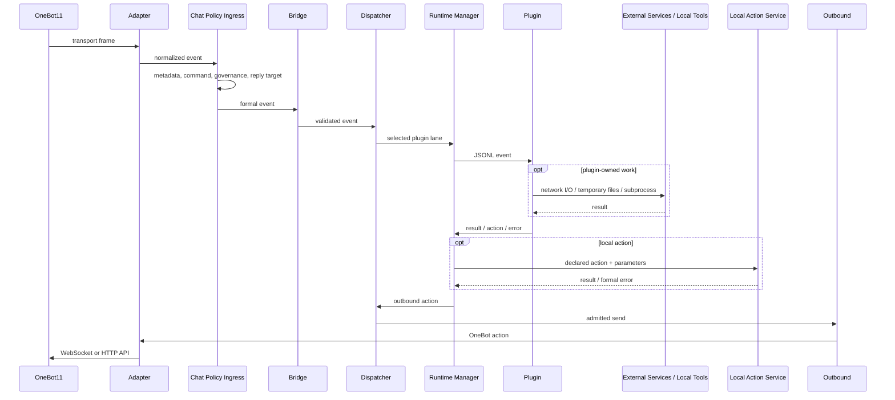
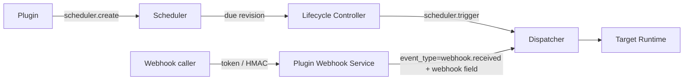

# Message Flow

本文档说明 OneBot11 入站、插件分发、平台 action、出站发送、调度和 webhook 的正式运行链路。事件与 action 字段以 `contracts/` 为准。

## 消息主流程

```mermaid
sequenceDiagram
    participant OB as OneBot11
    participant AD as Adapter
    participant IN as Chat Policy Ingress
    participant BR as Bridge
    participant DP as Dispatcher
    participant RT as Runtime Manager
    participant PL as Plugin
    participant EXT as External Services / Local Tools
    participant LA as Local Action Service
    participant OUT as Outbound

    OB->>AD: transport frame
    AD->>IN: normalized event
    IN->>IN: metadata, command, governance, reply target
    IN->>BR: formal event
    BR->>DP: validated event
    DP->>RT: selected plugin lane
    RT->>PL: JSONL event
    opt plugin-owned work
        PL->>EXT: network I/O / temporary files / subprocess
        EXT-->>PL: result
    end
    PL->>RT: result / action / error
    opt local action
        RT->>LA: declared action + parameters
        LA-->>RT: result / formal error
    end
    RT->>DP: outbound action
    DP->>OUT: admitted send
    OUT->>AD: OneBot action
    AD->>OB: WebSocket or HTTP API
```

### 职责归属

| 环节 | 职责方 | 状态来源 |
| --- | --- | --- |
| transport 与协议帧 | Adapter | connection snapshot、echo waiters、dedupe state |
| 命令与聊天治理 | `eventpipeline/chatpolicy` | 配置与治理服务 |
| 统一事件校验 | Bridge | formal event contract |
| 目标与队列 | Dispatcher | manifest events、command declarations、per-plugin lanes |
| 插件进程协议 | Runtime Manager | runtime snapshot 与 event session |
| 插件自有工作 | Plugin | 进程内状态、进程创建的临时目录与辅助程序 |
| 平台 action | Local Action Service | permissions 与领域服务 |
| 出站限流与发送 | Outbound / Adapter | rate limit、reply target、transport snapshot |

同一 `event.target` lane 保持 FIFO；不同目标可在插件并发度内并行。队列满时 Dispatcher 返回内部 `OutcomeDropped`，以 `queue_full` 原因计入观测摘要并丢弃该次投递；不会向原始入站调用方返回插件拒绝结果，也不会产生无归属的 pending 状态。

## 入站语义

Adapter 负责 transport 鉴权、协议帧分类、连接状态、事件去重和 OneBot11 字段归一化。`eventpipeline/chatpolicy` 的 Ingress 补齐可用的 bot、用户、群和 reply target 元数据，解析命令，并执行白名单、黑名单、命令权限与冷却拦截。

Bridge 只处理 OneBot11 归一化事件。无法通过正式结构校验的事件进入结构化诊断，不交给插件。

Dispatcher 只向可投递的 runtime 发送事件。命令声明优先选择目标插件，其余事件按 `event_type` 订阅匹配。

## 插件动作

插件通过 Runtime Manager 发起 local action。每个 action 必须：

- 使用独立 `request_id`，并通过 `parent_request_id` 关联当前事件；
- 在 manifest 中声明对应权限；插件私有日志、配置、KV 和文件动作除外；
- 满足权限范围和资源上限；
- 返回正式 result 或 error envelope。

Runtime Manager 不直接访问宿主管理存储、配置、secret、渲染、调度、治理或 OneBot provider；插件需要这些 RayleaBot 能力时，由 Local Action Service 执行。

插件是管理员确认后运行的完全可信本地原生代码。插件可自行访问外部服务、创建临时文件并启动随 artifact 发布的辅助程序；这些操作不进入 Runtime Manager 或 Local Action Service，也不受宿主 `http.request`、`storage.file` 配额或 local action 审计约束。插件负责对应操作的超时、资源上限、并发和清理。插件不能用直接 I/O 读取或修改 RayleaBot 的配置、secret、状态库、安装目录等宿主状态，也不能绕过 Dispatcher 与 Outbound 发送聊天平台消息。

## 出站语义

插件返回 `message.send` 后，Dispatcher 是唯一执行出口；回复通过同一动作的回复字段表达。Outbound 按插件和目标执行 admission、限流、熔断与冷却，并为每个获准动作发起一次发送。Adapter Send 把消息段转换为 OneBot11 `send_msg` 参数；WebSocket 可用时选择 WebSocket 并等待 echo，不可用时按配置选择 `http_api`。选定传输发送失败后返回正式错误，不自动重试。

冷却提示、内置菜单和调度消息共享同一条 Outbound 与 Adapter Send 链路。

## 调度与 webhook

```mermaid
flowchart LR
    P["Plugin"] -->|"scheduler.create"| S["Scheduler"]
    S -->|"due revision"| LC["Lifecycle Controller"]
    LC -->|"scheduler.trigger"| D["Dispatcher"]
    D --> R["Target Runtime"]

    H["Webhook caller"] -->|"token / HMAC"| WH["Plugin Webhook Service"]
    WH -->|"event_type=webhook.received + webhook field"| D
```

Scheduler 以插件 ID、任务 ID 和 revision 维护单一串行 mutation path。旧 trigger 不能覆盖或复活更新后的 job。Scheduler 只投递 `scheduler.trigger`，消息仍由插件通过正式出站 action 发送。

Plugin Webhook Service 验证 route、token/HMAC 和目标插件后，构造 `event_type=webhook.received` 的事件；来源元数据放在该事件的 `webhook` 字段，其中 `route` 与 `received_at` 必填。Webhook 事件定向进入 Dispatcher，不经过 OneBot11 Bridge。

其他平台内部事件如 `config.changed`、`bot.identity.changed` 和 `management.action` 也可按目标直接进入 Dispatcher，但仍使用同一 runtime、local action 和出站链路。

## 关键边界

- Adapter 不写业务状态库。
- `eventpipeline/chatpolicy` 的 Ingress 是命令与聊天治理职责方；Bridge 只校验统一事件。
- Dispatcher 是插件事件排队和出站 action 的职责方。
- Runtime Manager 管理插件进程协议。
- Local Action Service 是插件访问 RayleaBot 宿主状态与聊天平台能力的唯一入口；插件自有的外部网络、临时文件和子进程工作由插件进程负责。
- Scheduler 与 webhook 只产生目标事件，不建立平行分发或发送通道。
