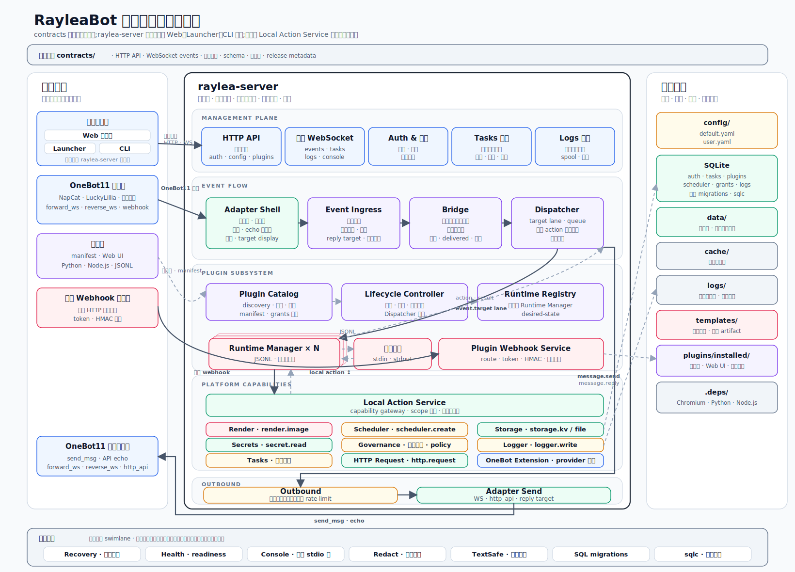

# Platform Architecture

本文档说明 RayleaBot 平台的组件分层、部署形态、运行资源和跨层边界。

`contracts/` 是 HTTP API、WebSocket events、插件协议、schema、错误码与 release metadata 的接口边界来源，文档中的字段、状态名、错误码和事件类型均以该目录为准。

## 总览

示意图采用统一视觉语言组织五条横向 swimlane、左右两列与底部附属区块：

- 顶部 `contracts/` 金色条是所有对外边界的唯一来源。
- 中央 `raylea-server` 框从上到下排列 5 条 swimlane：管理面、事件主链、插件子系统、平台能力、出站。
- 左列汇总外部入口（Web / Launcher / CLI、OneBot11、插件包、插件 webhook 调用方、OneBot11 出站客户端）；右列汇总运行资源（config、SQLite、data、cache、logs、templates、plugins/installed、.deps 以及内嵌跨 swimlane 服务）。
- 底部两个面板分别是 OneBot11 归一化事件清单（25 项 OneBot 事件 + 4 项平台内部事件）和 3 个核心状态机的可视化状态轨迹。
- 黑色实线箭头沿 ①-⑫ 顺序编号串起一次完整事件处理与出站发送；灰色虚线箭头表示 local action 与 JSONL 的本地回调；红色虚线箭头标出外部 webhook 的独立入站路径。

顶部图例同时说明 6 种色块归属（管理面、事件主链与出站、插件子系统、平台能力与 Contracts、Runtime 进程与 Webhook、运行资源与横切组件）。详细事件枚举见 [Event Model](./event-model.md)，状态枚举见 [State Model](./state-model.md)。

`raylea-server` 是平台唯一的可执行二进制，内含管理面、事件主链、插件子系统、平台能力与出站五条横向链路。Web、Launcher、CLI 三类管理客户端共享同一二进制并消费同一套管理接口；OneBot11 协议接入和插件 Webhook 调用方分别经协议适配与 Webhook Service 进入事件主链；插件统一通过 Local Action Service 这一受控网关访问平台能力。

### 主流向编号说明

| 编号 | 语义 | 对应链路 |
| --- | --- | --- |
| ① | 管理请求进入 | 管理客户端 → HTTP API / 管理 WebSocket |
| ② | OneBot11 入站 | OneBot11 接入方 → Adapter Shell |
| ③ | 归一化事件前推 | Adapter Shell → Event Ingress |
| ④ | 统一事件校验 | Event Ingress → Bridge |
| ⑤ | 目标选择与排队 | Bridge → Dispatcher |
| ⑥ | 事件入队到目标插件 | Dispatcher → Runtime Registry → Runtime Manager（按 `event.target` lane 划分） |
| ⑦ | 投递事件到插件 | Runtime Manager → 插件子进程（JSONL） |
| ⑧ | 插件回传 | 插件子进程 → Runtime Manager（`result` / `action` / `error`） |
| ⑨ | 插件访问平台能力 | Runtime Manager → Local Action Service |
| ⑩ | 平台能力返回 | Local Action Service → Runtime Manager |
| ⑪ | 插件返回出站 action | Dispatcher → Outbound |
| ⑫ | OneBot11 出站发送 | Outbound → Adapter Send → OneBot11 出站客户端（并回填 echo） |

外部 webhook 走独立通道：插件 Webhook 调用方直接进入 Plugin Webhook Service，定向投递 `webhook.received` 事件到 Dispatcher，不经过 Adapter Shell / Bridge。

## 部署形态

`raylea-server` 通过单二进制对外提供两种运行模式：

- **Server 模式**：不带子命令参数时启动 HTTP / WebSocket 服务、事件主链与插件子系统，处理来自 Web、Launcher 和 OneBot11 的入站请求。
- **CLI 模式**：带子命令参数时复用同一二进制执行备份、恢复、依赖检查与诊断子命令，运行结束即退出。

Launcher 作为桌面外壳通过子进程托管同一份 `raylea-server` 二进制，负责本机预检、进程编排、版本提示和打开 Web 管理面。Launcher 自身不复制服务端业务逻辑，与 Web、CLI 一样消费 Server 模式暴露的同一套管理 HTTP API 与管理 WebSocket。

## 组件分层

| 层级 | 组件 | 作用 |
| --- | --- | --- |
| 外部入口 | Web 管理面、Launcher、CLI、OneBot11 接入方、插件 Webhook 调用方 | 访问管理面、启动服务、接入聊天协议或触发插件事件 |
| 管理面 | HTTP API、管理 WebSocket、Auth & 会话、Tasks 通道、Logs 通道 | 为 Web、Launcher、CLI 提供共享的管理入口与实时通道 |
| 服务组装 | App、Config、System Service、Protocol Service | 组装服务、加载配置、发布状态、协调启动与关闭 |
| 事件主链 | Adapter、Event Ingress、Bridge、Dispatcher | 接入 OneBot11 事件，完成命令解析、聊天治理、统一事件校验、目标选择与队列调度 |
| 插件子系统 | Plugin Catalog、Lifecycle Controller、Runtime Registry、Runtime Manager、Plugin Webhook Service | 管理插件安装、启停、授权、进程通信和插件 webhook |
| 平台能力 | Local Action Service、Render、Scheduler、Storage、Secrets、Governance、Logger、Tasks、HTTP Request、OneBot Extension | 经 Local Action Service 网关受控访问的能力子系统 |
| 出站链路 | Outbound、Adapter Send | 按插件与目标排队限流并通过 OneBot11 transport 投递 |
| 运行资源 | SQLite、`config/`、`data/`、`cache/`、`logs/`、`templates/`、`plugins/installed/`、`.deps/` | 状态、配置、缓存、日志、模板、插件包与运行环境的持久化目录 |

## 管理入口

管理面是单一接口集合，Web、Launcher、CLI 全部消费同一套管理 HTTP API 与管理 WebSocket，无并行控制面。管理面通道包括：

- **HTTP API**：按领域路由暴露认证、配置、插件、任务、日志、协议、渲染、治理与系统操作。
- **管理 WebSocket**：推送任务更新、日志追加、协议事件与插件 console 流。
- **Auth & 会话**：负责登录鉴权、会话签名密钥、登录失败限速。
- **Tasks 通道**：订阅插件安装、备份、恢复等异步任务的进度与终态。
- **Logs 通道**：推送结构化日志流并支持 spool 回放。

CLI 模式下 backup、restore、doctor、cleanup 子命令通过 `app` 包内组装的同一套服务对象访问 Storage、Secrets、Recovery 等子系统，使本地诊断与服务运行使用同一组真理来源。

## 事件主链

OneBot11 入站事件经四段固定链路处理：

1. **Adapter**：负责传输鉴权、协议帧分类、状态快照、事件去重与 echo 等待表。
2. **Event Ingress**：补齐元数据与 reply target，解析命令前缀，执行白名单、黑名单、命令权限与冷却治理；内置菜单命令在此处直接渲染并发送。
3. **Bridge**：校验统一事件结构、补齐桥接层观测字段，并区分 `delivered` / `ignored` / `rejected` / `error` 四种结果。
4. **Dispatcher**：按命令声明或 `event_type` 订阅选择目标插件，按 `event.target` 划分 lane 并维护插件队列。

Dispatcher 是插件事件投递与插件出站 action 执行的唯一出口。`scheduler.trigger`、`webhook.received`、`config.changed`、`bot.identity.changed` 等平台内部事件不经 Bridge，直接进入 Dispatcher 的目标投递路径。

## 插件子系统

插件子系统由 5 个组件组成，各自负责独立职责且通过窄接口协作：

- **Plugin Catalog**：负责 discovery、安装、卸载、manifest 解析、插件 desired-state 仓库与能力 grants 仓库。
- **Lifecycle Controller**：负责插件启停、重载、崩溃恢复，并把 runtime 注册到 Dispatcher。
- **Runtime Registry**：维护多个 Runtime Manager 的实例集合，提供按插件 ID 的查询与遍历能力。
- **Runtime Manager**：每个插件对应一个 Manager，管理子进程、JSONL 协议帧、ping 保活、事件 session 与 local action RPC。
- **Plugin Webhook Service**：暴露外部 HTTP webhook 端点，完成 token 与 HMAC 校验、按需拉起目标插件、定向投递 `webhook.received` 事件。

插件包以子进程形式运行，通过 stdin / stdout 上的 JSONL 协议与 Runtime Manager 通信。插件不能直接访问平台内部对象，也不能直接读写 `config/user.yaml`。

## 平台能力

Local Action Service 是插件访问平台能力的唯一入口，负责能力授权、scope 校验和结构化错误返回。能力按作用域分组归类：

- **配置**：`config.read` / `config.write`
- **存储 / 凭据**：`storage.kv` / `storage.file`、`secret.read`
- **渲染 / 出站**：`render.image`、`http.request`（host-allowlist）
- **调度与事件暴露**：`scheduler.create`、`event.expose_webhook`
- **治理**：`governance.blacklist.*` / `governance.whitelist.*` / `governance.command_policy.read`
- **日志与插件元数据**：`logger.write`、`plugin.list`
- **OneBot 协议直通**：OneBot11 generic action 与 `protocolcap` 注册的 provider 扩展动作（`provider.*`）

## 出站链路

插件返回 `message.send` 或 `message.reply` 时，Dispatcher 触发出站链路并由两个组件接力执行：

- **Outbound**：按插件 ID 与目标维度维护出站队列，执行 rate-limit、冷却提示与失败重试策略。
- **Adapter Send**：把出站消息段投影为 OneBot11 `send_msg` 参数，在 WebSocket 已连接时优先通过 `forward_ws` 或 `reverse_ws` 发送并等待 echo，WebSocket 不可用时通过配置的 `http_api` 回退发送；通过 reply target cache 定位 `message.reply` 的原消息会话。

冷却提示、内置菜单回复与定时消息出站全部复用同一条 Outbound + Adapter Send 链路，不存在并行发送通道。

## 数据与运行资源

| 资源 | 内容 |
| --- | --- |
| `config/` | `default.yaml`、`user.yaml`，合并后的运行配置由 Config 模块裁决 |
| SQLite | 唯一正式状态库，保存 auth、tasks、plugins、grants、scheduler、logs；当前 schema 内置于服务端，查询经 sqlc 生成 |
| `data/` | 状态库与插件业务数据沙箱 |
| `cache/` | 可重建缓存，清理后不影响正确性 |
| `logs/` | 结构化日志、诊断输出与 spool 文件 |
| `templates/` | 渲染模板版本目录与产物 artifact |
| `plugins/installed/` | 已安装插件包、Web UI 资源与每插件数据沙箱 |
| `.deps/` | Chromium、Python、Node.js 等运行环境资源，由 deps 模块统一解析入口 |

## 横切组件

下列组件参与全部 swimlane，提供启动与运行期支撑：

- **Recovery**：启动恢复摘要、运行环境检查和插件兼容处理建议。
- **Health**：readiness 与依赖检查，供 Launcher 与 CI smoke 使用。
- **Console**：插件 stdout / stderr 流与管理面 console 通道。
- **Redact**：日志脱敏，防止凭据泄漏。
- **TextSafe**：文本安全过滤，服务于聊天治理与渲染输入。
- **Schema Bootstrap**：服务端内置当前 SQLite schema，通过 modernc.org/sqlite 驱动初始化状态库。
- **sqlc**：从 SQL 源生成的查询入口，服务端只通过生成器入口访问数据库。

## 关键边界

- `contracts/` 是 HTTP、WebSocket、插件协议、schema、错误码和 release metadata 的正式来源。
- Server 是正式状态源，Web 与 Launcher 不维护并行状态模型。
- Adapter 只处理 OneBot11 协议接入、归一化、状态和 API 调用。
- Event Ingress 是聊天治理与命令解析入口，Bridge 只做统一事件结构校验。
- Dispatcher 是插件事件排队和插件出站 action 的唯一执行出口。
- Runtime Manager 只负责插件进程协议和生命周期状态，不直接执行平台能力。
- Local Action Service 是插件访问平台能力的唯一入口。
- Outbound 是出站排队与限流的统一出口，Adapter Send 是 OneBot11 出站投递的唯一入口。
- Tasks 是后台异步任务的统一执行器，管理面通过 Tasks 通道订阅任务终态。
- Scheduler 不直接发送聊天消息，只触发插件事件。
- Render Service 是图片渲染的统一平台能力，插件不各自维护浏览器截图链路。

## 相关文档

- [Message Flow](./message-flow.md)
- [Bot Core](./bot-core.md)
- [Event Model](./event-model.md)
- [State Model](./state-model.md)
- [Platform Runtime](./platform-runtime.md)
- [Render Service](./render-service.md)

## 附录：代码地图

文档中的逻辑组件对应到 `server/internal/` 的实际包与对象。

| 逻辑组件 | 实际位置 |
| --- | --- |
| App / 服务组装 | `server/internal/app/` |
| Event Ingress | `server/internal/app/`（在 `app` 包内组装，`chat_policy.go` + `runtime_start.go`） |
| Plugin Lifecycle Controller | `server/internal/app/`（在 `app` 包内组装，`plugin_lifecycle*.go`） |
| Runtime Registry | `server/internal/app/runtime_registry.go` |
| HTTP / WebSocket handlers | `server/internal/app/*_http.go` 与 `*_ws.go` 按领域散布 |
| Adapter | `server/internal/adapter/` |
| Bridge | `server/internal/bridge/` |
| Dispatcher | `server/internal/dispatch/` |
| Outbound | `server/internal/outbound/` |
| Runtime Manager | `server/internal/runtime/` |
| Local Action Service | `server/internal/localaction/` |
| Render Service | `server/internal/render/` |
| Scheduler | `server/internal/scheduler/` |
| Storage(SQLite) | `server/internal/storage/`（内置 `schema.sql`） |
| sqlc 生成入口 | `server/internal/sqlcgen/`(SQL 源在 `sqlcqueries/`) |
| Auth & 会话 | `server/internal/auth/` |
| Governance | `server/internal/governance/` |
| Secrets | `server/internal/secrets/` |
| Logger | `server/internal/logging/` |
| Tasks | `server/internal/tasks/` |
| CLI 子命令 | `server/internal/cli/` |
| 健康检查 | `server/internal/health/` |
| 启动恢复 | `server/internal/recovery/` |
| 依赖资源解析 | `server/internal/deps/` |

插件子系统按职责拆分为 8 个 `plugin*` 前缀包：

- **Plugin Catalog**：`server/internal/plugins/`（discovery、安装、卸载、manifest、grants、desired-state）
- **插件配置存储**：`server/internal/pluginconfig/`
- **插件文件沙箱**：`server/internal/pluginfile/`
- **插件 KV 存储**：`server/internal/pluginkv/`
- **插件出站 HTTP 客户端**：`server/internal/pluginhttp/`（host-allowlist）
- **插件管理 UI**：`server/internal/pluginui/`
- **Plugin Webhook Service**：`server/internal/pluginwebhook/`
- **OneBot provider 扩展能力注册**：`server/internal/protocolcap/`

入口位于 `server/cmd/raylea-server/main.go`，根据是否带子命令参数分发到 `cli.Run(...)` 或 `app.New(...).Run(ctx)`。
