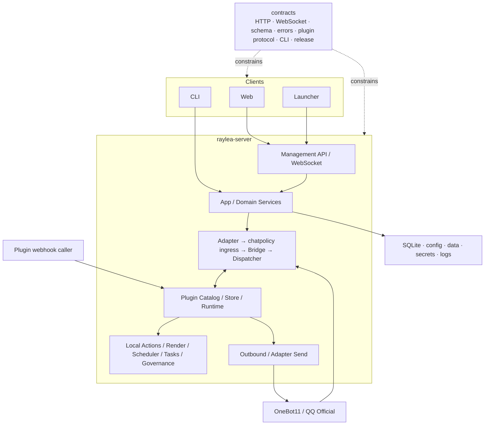
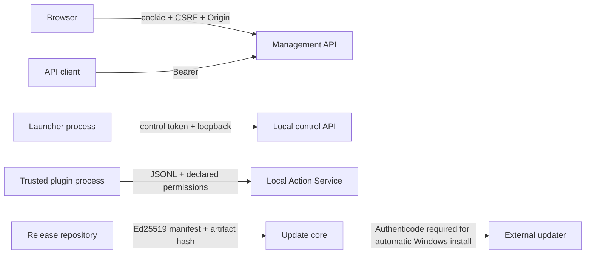

# Platform Architecture

本文档定义 RayleaBot 的组件职责方、信任边界、状态来源和跨层依赖。字段、状态、错误码和协议结构以 `contracts/` 为准。

## 总览

```mermaid
flowchart TB
    C["contracts<br/>HTTP · WebSocket · schema · errors · plugin protocol · CLI · release"]

    subgraph Clients["Clients"]
        W["Web"]
        L["Launcher"]
        CLI["CLI"]
    end

    subgraph Server["raylea-server"]
        API["Management API / WebSocket"]
        APP["App / Domain Services"]
        PIPE["Adapter → chatpolicy ingress → Bridge → Dispatcher"]
        PR["Plugin Catalog / Store / Runtime"]
        CAP["Local Actions / Render / Scheduler / Tasks / Governance"]
        OUT["Outbound / Adapter Send"]
    end

    OB["OneBot11 / QQ Official"] --> PIPE
    HOOK["Plugin webhook caller"] --> PR
    W --> API
    L --> API
    CLI --> APP
    API --> APP
    APP --> PIPE
    PIPE <--> PR
    PR --> CAP
    PR --> OUT
    OUT --> OB
    APP --> STATE["SQLite · config · data · secrets · logs"]

    C -. constrains .-> Clients
    C -. constrains .-> Server
```

## 职责归属与状态来源

| 领域 | 职责方 | 正式状态来源 | 消费者 |
| --- | --- | --- | --- |
| 对外接口与发布元数据 | `contracts/` | schema、OpenAPI、WebSocket、errors、CLI、fixtures | 所有实现与文档 |
| 服务生命周期与运行状态 | App / domain services | SQLite、配置快照、受保护内存状态 | API、CLI、Launcher |
| 聊天适配器连接与事件 | Adapter / Event Pipeline | 按实例隔离的 adapter snapshot 与统一事件 | Dispatcher、协议管理面 |
| 三方平台集成 | Integrations | 平台账号、资料、扫码会话与校验结果 | 三方账号服务、插件动作、管理面 |
| 插件静态声明 | Plugin Catalog | 校验后的 manifest、管理页入口、安装来源 | Lifecycle、管理面 |
| 插件商店目录 | Plugin Store Service | HTTPS 来源的已校验 catalog、来源元数据与刷新状态 | 安装流程、管理面 |
| 插件进程状态 | Runtime Manager | per-plugin runtime snapshot | Lifecycle、管理视图；Dispatcher 只读取投递就绪状态 |
| 后台任务 | Task Registry | 有序持久化记录 | API/WebSocket、恢复逻辑 |
| 调度任务 | Scheduler | SQLite job 与内存 revision | 插件定向事件 |
| 图片渲染 | Render Service | 模板仓、artifact 与 cache metadata | Local Action、管理面 |
| Chromium 与 FFmpeg 资源 | Deps Service | `.deps/manifest.json`、准备目录与诊断快照 | 渲染、抖音扫码兜底、受信本地插件媒体处理、运行环境准备与系统诊断；doctor 只读取清单元数据 |
| 配置单实例锁 | File Lock / App | `<config-path>.runtime.lock` | Server 启动、配置 CLI |
| 更新信任 | Shared update core | 编译内置仓库/公钥、最高版本与 digest 记录 | CLI、API、Launcher、updater |
| 更新事务 | External updater | 安装根外 journal、offline backup、staging | Launcher 与恢复流程 |
| 客户端视图 | Web / Launcher | API/WebSocket 的临时视图 | 用户 |

Web 和 Launcher 不持有正式业务状态。缓存可丢弃，不能反向覆盖服务端。

## 信任边界

```mermaid
flowchart LR
    Browser["Browser"] -->|"cookie + CSRF + Origin"| API["Management API"]
    Tool["API client"] -->|"Bearer"| API
    Launcher["Launcher process"] -->|"control token + loopback"| Control["Local control API"]
    Plugin["Trusted plugin process"] -->|"JSONL + declared permissions"| Actions["Local Action Service"]
    Release["Release repository"] -->|"Ed25519 manifest + artifact hash"| Core["Update core"]
    Core -->|"Authenticode required for automatic Windows install"| Helper["External updater"]
```

| 边界 | 接受条件 | 拒绝条件 |
| --- | --- | --- |
| 浏览器管理 | 合法 Host/Origin、cookie 会话、unsafe method CSRF | query token、跨站请求、伪造 Host、错误 Origin |
| 初始化 | loopback、一次性 setup token、JSON、Fetch Metadata | token 缺失/复用、跨站表单、非法 Host |
| Launcher 控制 | loopback 直连与进程级 control token | 无凭据 shutdown、代理转发来源 |
| 插件代码 | 用户检查来源、目标平台、artifact 摘要和权限后确认 | 未确认安装、非法包路径、摘要不一致、未声明权限 |
| 发布更新 | 编译内置仓库与公钥、Ed25519、摘要、重放防护 | 可修改 metadata 改信任根、过期、降级、同版换包 |
| Windows 安装 | 发布信任校验与正式 Authenticode 均通过 | 自签名、signer 不符、任一 PE 验签失败 |

第三方插件是完全可信的本地代码。Permission 是平台 API 的访问控制，不是 OS 安全沙盒。

## 组件职责

| 组件 | 职责 | 禁止承担 |
| --- | --- | --- |
| App | 服务组装、启动、关闭和领域服务协调 | 把内部对象暴露给客户端 |
| Management handlers | transport、鉴权、参数校验、错误映射 | 业务状态机和私有字段 |
| Adapter | OneBot11 transport、鉴权、归一化、动作转换 | 业务持久化和插件治理 |
| Chat Policy Ingress | `bot/pipeline/chatpolicy` 中的元数据、命令解析、聊天治理、reply target | 插件进程管理或治理数据突变 |
| Bridge | 统一事件结构校验与观测 | 平台内部事件的重复转发层 |
| Dispatcher | 插件目标选择、队列和出站 action 执行 | 直接访问插件私有存储 |
| Runtime Manager | 插件子进程、JSONL、握手、保活和事件 session | 直接执行平台能力 |
| Plugin Store Service | 官方与自定义 catalog 来源、持久化缓存、来源视图和安装委托 | 绕过统一插件安装事务或持有插件运行状态 |
| Local Action Service | permission 与参数校验、平台能力网关 | 绕过正式 action contract |
| Task Registry | admission、执行状态、有序持久化和关闭 drain | 为队列已满请求创建 pending task |
| Scheduler | revision、到期检查和插件事件触发 | 直接发送聊天消息 |
| Render Service | 模板校验、Chromium、artifact、资源摘要和缓存 | 插件自建并行截图链路 |
| Launcher | 本机进程、预检、更新检查和安装确认 | 在线业务状态或 Web 页面复制 |
| External updater | 复验、备份、staging、swap、postflight、rollback | 从可修改文件读取信任根 |

## 数据与资源

| 资源 | 职责方 | 语义 |
| --- | --- | --- |
| 内嵌 schema 默认值、`config/user.yaml` | Config | 校验后合并为运行快照 |
| SQLite | Server services | auth、tasks、plugins、scheduler、logs 等正式状态 |
| `data/` | Server services | 状态库与服务端业务数据 |
| `data/plugins/` | Plugin File Store | 每插件文件工作目录；artifact 升级不覆盖该目录 |
| `plugins/installed/` | Plugin Catalog | 经校验的插件 artifact、后端二进制与包内管理页资源 |
| `templates/` | Render Service | 模板版本与资源 |
| `cache/` | 各自归属 | 可重建缓存，不影响正确性 |
| `logs/` | Logging | 结构化日志、spool 与诊断输出 |
| `.deps/` | Deps service | Chromium 与 FFmpeg / FFprobe 受控资源 |
| updater transaction directory | External updater | journal、offline backup、旧版与 staging |

## 部署边界

`raylea-server` 在 Server 模式提供 HTTP/WebSocket、事件链和插件子系统，在 CLI 模式复用同一领域服务执行诊断、备份、恢复和更新校验。Launcher 以子进程托管 server，并通过独立 control token 管理本机进程。

单实例与本地 SQLite 是正式部署模型。多实例、高可用、远程状态库和新的客户端控制面需要独立 contract 与一致性设计。

## 代码地图

| 领域 | 位置 |
| --- | --- |
| App 与 HTTP wiring | `server/internal/app/` |
| Management handlers | `server/internal/management/` |
| Auth | `server/internal/platform/auth/` |
| OneBot11 adapter | `server/internal/bot/adapters/onebot11/` |
| Event pipeline | `server/internal/bot/pipeline/` |
| Third-party integrations | `server/internal/integrations/` |
| Plugin catalog/lifecycle/runtime/actions | `server/internal/plugins/` |
| Plugin Store Service | `server/internal/plugins/market/` |
| Tasks / Scheduler | `server/internal/tasks/`、`server/internal/scheduler/` |
| Render | `server/internal/render/` |
| Managed Chromium / FFmpeg | `server/internal/platform/deps/` |
| Process/config locks | `server/internal/platform/filelock/` |
| Storage / migrations | `server/internal/storage/`、`server/internal/sqlcgen/` |
| Shared update core | `server/internal/releaseupdate/` |
| 共享诊断 | `server/internal/operations/diagnostics/` |
| CLI | `server/internal/cli/` |
| Launcher | `launcher/` |

## 相关文档

- [Message Flow](./message-flow.md)
- [Event Pipeline](./event-pipeline.md)
- [Plugin Runtime](./plugin-runtime.md)
- [State Model](./state-model.md)
- [Platform Runtime](./platform-runtime.md)
- [Delivery and Upgrade](../release/delivery-and-upgrade.md)
