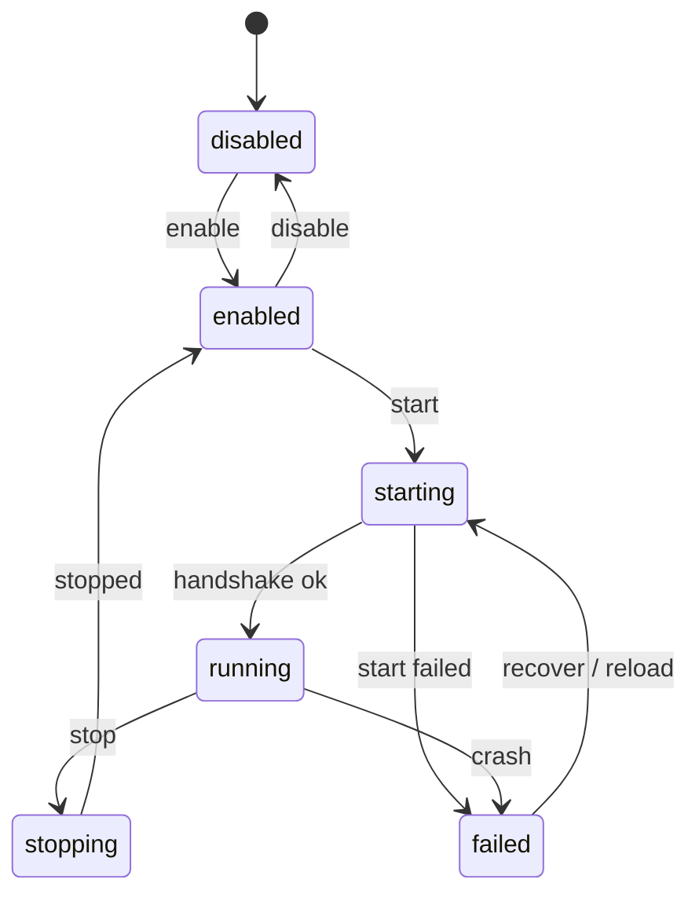
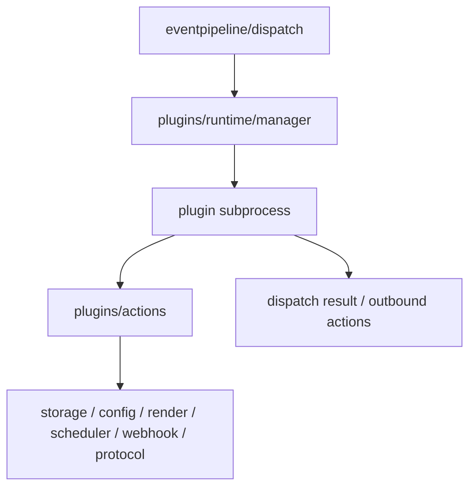

# Plugin Runtime

插件运行在独立子进程中，通过 JSONL runtime protocol 与服务端通信。插件不能直接访问服务端内部对象。

## 状态链路

`internal/plugins/lifecycle` 负责 desired state、runtime state、重载和崩溃恢复。`internal/plugins/runtime/manager` 负责单个插件进程的握手、ping、事件 session 和本地 action RPC。

## 事件与本地 action

本地 action 是插件访问平台能力的唯一入口。新增 action 应通过 `plugins/actions` 的模块注册接入，声明 capability、权限和参数校验，避免插件 runtime 直接 import 管理层或业务实现细节。

## 管理视图

管理 API 展示对象由插件视图层生成。新增管理端字段不应直接修改 runtime 内部状态结构；新增 runtime 状态也不应自动暴露到 API。状态名称需要在 runtime、API 和 UI 之间保持语义一致。
