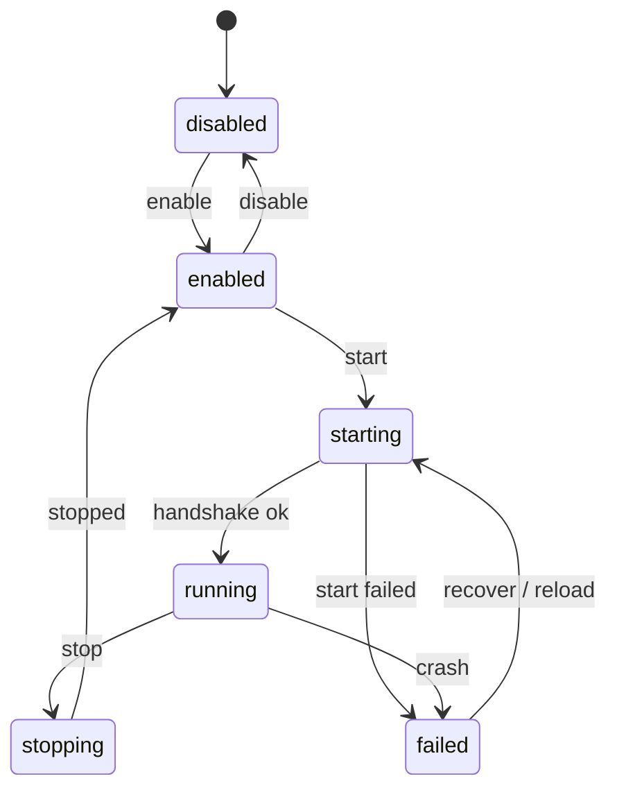
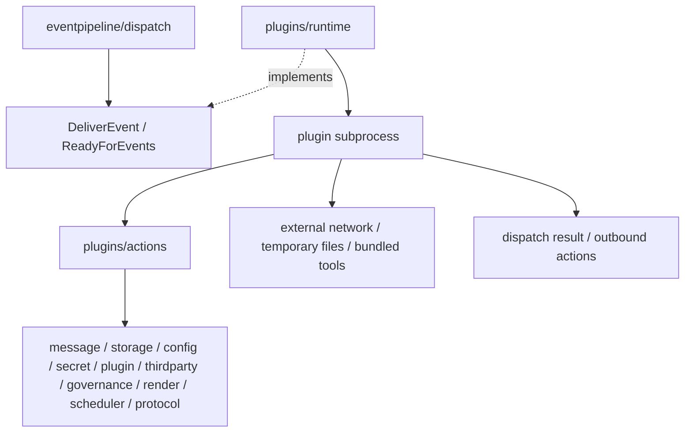

# Plugin Runtime

插件后端是经过 artifact 校验的当前平台原生可执行文件，运行在独立子进程中，通过 JSONL plugin protocol v3 与服务端通信。当前版本不提供插件 OS 强沙盒；管理员启用的插件按完全可信本地代码运行，但不能直接访问服务端内部对象。

## Artifact 边界

安装器只接受平台预编译目录或单根目录 ZIP。`info.json` v3 描述语言无关插件合同，`artifact.json` v2 只固定目标平台和入口。安装器扫描实际文件；最低 Core 版本、平台、二进制格式、路径边界和 UI 入口全部通过后，才原子发布目录。

Runtime Manager 直接启动 `bin/<plugin>[.exe]`，参数为空。服务端不运行 `go build`、`pnpm`、安装脚本或语言包管理器；路径必须是 artifact 根内的普通文件，Unix 后端必须有 executable bit。插件使用的随包辅助程序、数据、许可证、notices 与 SBOM 必须位于同一 artifact 根目录，并接受统一的实际文件扫描和资源上限检查。

## 状态链路

```mermaid
stateDiagram-v2
  [*] --> disabled
  disabled --> enabled: enable
  enabled --> starting: start
  starting --> running: handshake ok
  starting --> failed: start failed
  running --> stopping: stop
  stopping --> enabled: stopped
  running --> failed: crash
  failed --> starting: recover / reload
  enabled --> disabled: disable
```

`internal/plugins/lifecycle` 负责 desired state、runtime state、重载和崩溃恢复。`internal/plugins/runtime` 负责单个插件进程的握手、ping、事件 session 和本地 action RPC。

重载先完成新进程握手，再替换 Dispatcher 的投递目标。新事件进入新队列，生命周期操作等待旧队列排空后停止旧进程；排空超时会取消旧投递，并用独立的关闭时间预算回收进程。新进程初始化失败时继续使用旧实例。

## 事件与本地 action

```mermaid
flowchart TD
  dispatcher["eventpipeline/dispatch"] --> delivery["DeliverEvent / ReadyForEvents"]
  runtime["plugins/runtime"] -. implements .-> delivery
  runtime --> plugin["plugin subprocess"]
  plugin --> localaction["plugins/actions"]
  localaction --> service["message / storage / config / secret / plugin / thirdparty / governance / render / scheduler / protocol"]
  plugin --> ownwork["external network / temporary files / bundled tools"]
  plugin --> result["dispatch result / outbound actions"]
```

本地 action 是插件访问 RayleaBot 宿主状态与聊天平台能力的唯一入口。完整 action 清单由[插件协议](../plugin/protocol.md#action-rpc)维护；新增宿主 action 应通过 `plugins/actions` 的模块注册接入，声明权限和参数校验，避免插件 runtime 直接 import 管理层或业务实现细节。

插件 stdout 专用于 JSONL 协议，stderr 进入受控插件日志。Runtime Manager 保持请求关联、超时、并发、重启、ping/pong、一次终态响应和 shutdown grace 语义。

`chatevent.Event`、`MessageSegment` 和 `MessageCommand` 不包含进程帧或调度回调。调度器把 `RunContext` 与事件分别交给 Dispatcher；运行记录不会被序列化给插件。宿主动作解码结果由 `plugins.Action` 承载，消息出口只接收 `chatevent.MessageCommand`。

## 信任与进程能力

- artifact 校验确认目标平台和入口，安装器另行确认插件身份并扫描实际文件；这些检查不判断代码行为是否安全。需要确认的安装或更新表示管理员信任该版本的本地原生代码。
- 插件可使用所选语言的标准库直接访问外部服务，可在进程创建的临时目录中缓存媒体，也可启动随 artifact 发布的辅助程序。此类操作不需要宿主权限，也不受宿主 `storage.file` 配额或 action 审计约束。
- 插件直接 I/O 的超时、下载大小、并发、临时文件清理、子进程退出和第三方许可证由插件负责。临时产物不属于宿主管理存储，不保证进入备份、恢复或卸载清理。
- RayleaBot 配置、secret、宿主管理存储、三方账号、渲染器、调度器、治理状态及 OneBot/provider 动作仍通过 Local Action Service 访问。插件不能直接修改 RayleaBot 的配置文件、状态库或已安装插件目录。

## 管理视图

管理 API 展示对象由插件视图层生成。新增管理端字段不应直接修改 runtime 内部状态结构；新增 runtime 状态也不应自动暴露到 API。状态名称需要在 runtime、API 和 UI 之间保持语义一致。
