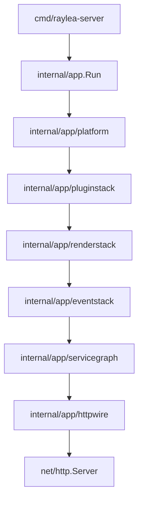
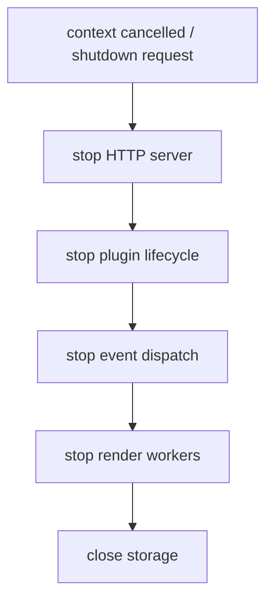

# Server Lifecycle

本页说明服务端启动、运行和关闭时的主要代码路径。

## 启动链路

`internal/app` 是组合根。它负责把配置、存储、日志、插件、渲染、事件管线和管理 HTTP 入口组装起来。业务规则留在各自领域包内，组合根只持有模块对外接口。

## 运行态资源

| 资源 | 主要路径 | 职责 |
| --- | --- | --- |
| 配置 | `internal/configruntime` | 读取、更新、脱敏和 apply policy |
| 存储 | `internal/storage` | SQLite schema、迁移和仓储 |
| 插件 | `internal/plugins/lifecycle`、`internal/plugins/runtime` | 插件启停、重载、进程协议和状态 |
| 事件 | `internal/eventpipeline` | 入站、桥接、分发和出站 |
| 渲染 | `internal/render` | 模板、队列、浏览器和 artifact |
| 管理入口 | `internal/management` | HTTP handlers 和 WebSocket events |

## 关闭链路

关闭顺序保持外部入口先停、后台任务后停、持久化资源最后释放。新的长期运行资源需要接入同一关闭链路，避免请求结束后继续无界运行。
