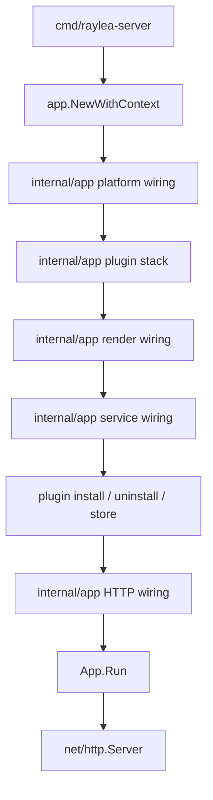
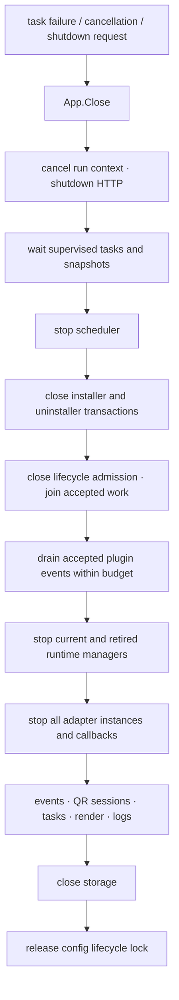

# Server Lifecycle

本页说明服务端启动、运行和关闭时的主要代码路径。

## 启动链路

```mermaid
flowchart TD
  cmd["cmd/raylea-server"] --> build["app.NewWithContext"]
  build --> platform["internal/app platform wiring"]
  platform --> pluginstate["internal/app plugin stack"]
  pluginstate --> render["internal/app render wiring"]
  render --> services["internal/app service wiring"]
  services --> mutations["plugin install / uninstall / store"]
  mutations --> httpwire["internal/app HTTP wiring"]
  httpwire --> run["App.Run"]
  run --> server["net/http.Server"]
```

`internal/app` 是组合根。它负责把配置、存储、日志、插件、渲染、事件管线和管理 HTTP 入口组装起来。业务规则留在各自领域包内，组合根只持有模块对外接口。

插件仓储和 Catalog 先于运行时业务服务创建；settings、Runtime Registry、Lifecycle 和管理事件建立后，再构造安装、卸载与插件商店。包事务的停止、初始化、回滚及模板检查回调在构造时注入，任务开始前依赖已完整。

`App.New` 在构建任何运行期服务前获取 `<config-path>.runtime.lock`。锁已被同配置的另一实例持有时启动立即失败；构建中途失败或 `App.Close` 完成时释放该锁。

构造失败按资源依赖逆序清理。平台先停止任务执行、持久化和日志刷新，再关闭 SQLite；渲染服务初始化失败也会释放已创建的 worker 与 runner。构造错误和清理错误一并返回。

## 运行态资源

| 资源 | 主要路径 | 职责 |
| --- | --- | --- |
| 配置 | `internal/config/runtime` | 读取、更新、脱敏和 apply policy |
| 存储 | `internal/storage` | SQLite 当前结构初始化和仓储 |
| 插件 | `internal/plugins/lifecycle`、`internal/plugins/runtime` | 插件启停、重载、进程协议和状态 |
| 事件 | `internal/bot/pipeline` | 入站、桥接、分发和出站 |
| 渲染 | `internal/render` | 模板、队列、浏览器和 artifact |
| 管理入口 | `internal/management` | HTTP handlers 和 WebSocket events |

## 关闭链路

```mermaid
flowchart TD
  signal["task failure / cancellation / shutdown request"] --> close["App.Close"]
  close --> http["cancel run context · shutdown HTTP"]
  http --> workers["wait supervised tasks and snapshots"]
  workers --> scheduler["stop scheduler"]
  scheduler --> mutations["close installer and uninstaller transactions"]
  mutations --> lifecycle["close lifecycle admission · join accepted work"]
  lifecycle --> drain["drain accepted plugin events within budget"]
  drain --> plugins["stop current and retired runtime managers"]
  plugins --> adapter["stop all adapter instances and callbacks"]
  adapter --> services["events · QR sessions · tasks · render · logs"]
  services --> storage["close storage"]
  storage --> lock["release config lifecycle lock"]
```

运行监督器独立启动任务，首个任务错误触发取消；HTTP 正常退出或取消竞争不会覆盖该错误。关闭先等待监督任务和数据库快照结束，再释放持久化资源。

`App.Close` 并发或重复调用只执行一次，所有调用者获得相同的聚合结果。单个资源关闭失败仍继续清理其他资源，SQLite 和配置生命周期锁最后释放。

插件事件 drain 超时仍会进入独立的进程回收预算。回收后，Catalog 按各 Manager 的实际快照更新运行状态与错误；持有活进程句柄的失败实例不会被一次停止尝试误标为已停止。

OneBot 成功停止时，入站处理、ready 回调、运行信息请求和反向连接会话均已退出。忽略取消的回调会导致 Stop 按 deadline 返回等待错误；该生命周期在回调实际退出前保持占用，不能启动第二个事件派发器。超时关闭不视为成功。
