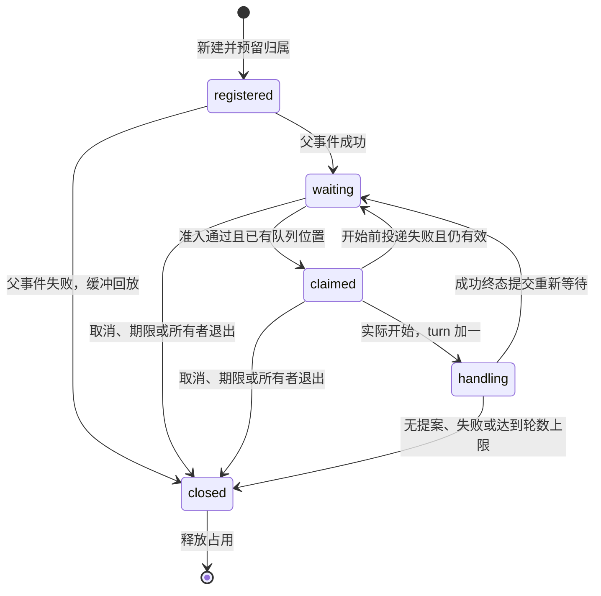

# v0.6 A0 设计验证记录

基准：`b67d2310`，2026-09-13。本文记录[执行计划](execution-plan-v0.6-conversation.md)的设计验证，隔离原型不进入 Server 或 SDK 的生产实现。

## 状态与调度

原型位于 [Server 设计测试](../server/tests/prototypes/conversation/state_test.go)和[票据设计测试](../server/tests/prototypes/conversation/scheduling_test.go)。

| 反例 | 预期与证据 |
| --- | --- |
| 提示完成前输入 | 留在原消息缓冲；父事件成功后才认领，`turn` 不提前增加 |
| 上一轮处理时连续输入 | 缓冲不绑定 state；成功提交提案后用新 revision/state 认领下一条，三轮最终释放路由 |
| 名单拒绝、没有队列位置 | 不认领、不增加轮次 |
| 32 个并发认领 | 只有一个成功；其余输入缓冲不超过 8 条 |
| 已认领但无法开始 | 仍有效时恢复 waiting；期限等于当前时刻时拒绝开始 |
| 发起失败与其他关闭 | 只有 registered 失败按原序回放；其他阶段关闭不回放，重复关闭无副作用 |
| 身份组件逐一改变 | 协议、实例、机器人、目标类型、目标、用户任一不同均不冲突 |
| A 命中 P→Q，B 仅命中 Q | 预留 Q 的 A 位置后才接受 B；激活后 Q 顺序为 A→B |
| A 高层停止或宿主停止 | 关闭 ready 唤醒 worker，剩余票据幂等结算，B 可以推进 |
| 下一消息快照反转 P/Q 优先级 | 枚举 256 个候选集合组合；依赖边沿 `(admission 序号, 层次)` 严格递增，不构成环 |

生产实现仍须在 C2/D3 验证既有 worker 的跨 lane 并发、真实队列拒绝、运行时代际和计时器回收；原型不替代这些集成验收。

## 准入与版本评审

| 输入或消费者 | 固定选择 | 实现归属 |
| --- | --- | --- |
| 同名 everyone/super_admin 命令 | 各候选授权；公共候选不继承另一声明的权限 | C3 |
| 白名单命中且黑名单命中 | 保留命令名单的白名单旁路关系；会话续接使用明确的名单准入模式，不伪造空命令 | C3/D3 |
| 普通消息、未知命令、菜单、会话回复 | 前置过滤均覆盖，过滤事件不含 session | C3/D3 |
| 当前完整前缀加“取消对话” | 名单准入后、过滤前检查取消权；普通“取消”和“0”留给业务 | D3 |
| 群级对话收到其他成员输入 | 只重新检查实际参与者的名单准入；参与者不继承发起者权限 | D3 |
| 同一个输入同时命中 user 与 conversation | user 优先；拒绝的会话输入不回落普通订阅 | D1/D3 |
| 旧 SDK 普通订阅者 | 普通消息 payload 不增加 session；session.closed 仅向主动登记并请求通知的原代际投递 | D3/E3 |
| 新能力插件安装到旧 Core | 正式安装路径已有 min_core_version 检查，新能力声明要求至少 0.6.0 | A2/E3 |
| 启动、重新加载已安装插件 | 当前 buildStartInputs 未检查最低版本，须统一补齐；手动复制运行目录不能作为旧核心已校验的证明 | C3/E3 |
| 自行实现 JSONL 的插件 | 新建与重新等待使用互斥形状；传播字段只接受成功终态，不依赖 SDK 特判 | A1/A2 |

协议 v3、manifest v3、配置 schema v4 保留。理由是登记由调用者主动发起，新增消息字段和关闭事件只进入其所有者进程，不扩散到旧订阅者；新增 local action 仍有父事件且使用现有请求/结果关联。A1/A2 必须补双端生成模型、合法/非法 fixtures；E3 必须实测旧 SDK 与新 Core、正式安装拒绝和自行实现 JSONL 的消费者，不能仅用 schema 验证代替。

确认的现有缺口：Dispatcher 的入队返回值不表达业务完成，终态动作错误未参与成功结算；C1 先修正完成结果。现有命令 Checker 在检查群冷却失败前可能已消耗用户冷却；C3 的一次性计费需要把用户/群检查与扣减放在同一临界区。

## SDK 所有权

[SDK 原型](../sdk/go/conversation_prototype_test.go)调用当前 `runtimeState.startEvent`，并发限制为 1。发起请求与三个答复各取得新的 EventContext；前一请求的自动终态与许可释放正常完成，已结束的 Context 拒绝后续 action。迟到事件不调用已经回收的续接者。发送失败、回复与本地超时争用同一个删除式领取入口，续接只交付一次。

宿主登记动作及实际提示发送留给 D4 的协议往返验收；本原型只验证处理调用可以正常返回、下一请求取得许可，以及本地映射不依赖关闭通知回收。阻塞式 Prompt 未实现，也未作为本次原型的结论。

## 时间与容量决定

以下字段统一放在 `runtime`，由 A2 更新配置契约和内嵌 schema。生产代码读取同一原子配置快照。

| 字段 | 默认 | 合法范围 |
| --- | --- | --- |
| session_default_timeout_seconds | 60 | 1..600，且不大于 session_max_timeout_seconds |
| session_max_timeout_seconds | 600 | 1..600 |
| session_max_lifetime_seconds | 1800 | 1..86400，且不小于 session_max_timeout_seconds |
| max_sessions_per_plugin | 256 | 1..4096，且不大于 max_sessions_total |
| max_sessions_total | 1024 | 1..16384 |
| max_session_buffered_inputs | 8 | 1..64 |
| filter_timeout_seconds | 5 | 1..60，且不大于 message_dispatch_timeout_seconds |
| message_dispatch_timeout_seconds | 120 | 1..600 |
| max_pending_message_dispatches | 1024 | 1..16384 |

`max_turns` 默认/上限 100、state 序列化上限 4096 字节、TTL 上限 31536000 秒属于协议参数约束。KV 清扫固定每 60 秒触发，每批最多 1000 行，每轮最多 5000 行或 250ms，不增加管理配置。

全局传播容量包含会话缓冲；票据引用原事件，不复制序列化消息。inactive 票据只占队列位置，不占执行许可。降低容量仅限制新接收；新期限设置只影响新的登记或提案，不改写已返回的截止时间。队首等待受消息剩余总预算约束，不能把“所在层预算”误解为多层排队总时长只等于一个插件超时。

## 迁移与恢复证据

[迁移原型](../server/tests/prototypes/conversation/migration_test.go)使用当前 Go SQLite 驱动与冻结的 [000001 全结构](../server/tests/prototypes/conversation/testdata/schema-000001.sql)：迁移前 `VACUUM INTO`、副本 `quick_check`、事务内加列和索引、写版本、故障回滚、原库字节不变、副本仍为 000001，以及新建和迁移后 `sqlite_master` 的归一化等价均通过。

[恢复演练](../scripts/release/rehearse_current_recovery.py)增加 `--legacy-schema`，从真实备份的数据构造真正的 000001 SQLite，保留配置、管理员认证和插件数据，manifest 记录归档真实版本。当前核心的演练结果为 **000001 → 000001**：空目录恢复、登录、两次启动和源库不变通过。迁移算法由 Go 隔离原型证明可行；**000001 → 000002 的真实 Server 启动演练仍由 B1 完成**，避免把 A0 对尚未存在的生产实现验收作为 B1 的循环前置条件。

迁移前副本采用 `<数据库文件名>.pre-migration-000001-<唯一标识>.db`，同目录保留；演练在发生迁移时要求恰有一份副本且其数据与归档一致。

## 已运行验证与剩余边界

- `server/`：`go test ./tests/prototypes/conversation -count=1`，8 项通过。
- `sdk/go/`：`GOWORK=off go test . -run ConversationPrototype -count=1`，2 项通过。
- `python -m unittest discover -s scripts/release/tests -p test_rehearse_current_recovery.py -v`，8 项通过。
- `python scripts/release/rehearse_current_recovery.py --server dist/conversation-a0/raylea-server.exe --output dist/conversation-a0/recovery-000001 --legacy-schema`，实际 Server 演练通过；本机产物位于 `dist/conversation-a0/recovery-000001/result.json`。
- 本机 Go 1.26.6、Python 3.14.7。`CGO_ENABLED=1 go test -race` 因没有 gcc 无法构建；CI 已登记原型包，尚无 CI 运行结果，E3 之前必须补齐。

A0.1/A0.3/A0.4 的隔离可行性与 A0.2/A0.6 的来源评审完成；上述生产验证由对应阶段承担。A0.5 的迁移算法和旧归档演练分别通过，生产迁移验收保留在 B1。本记录不宣称 v0.6 已可发布。
