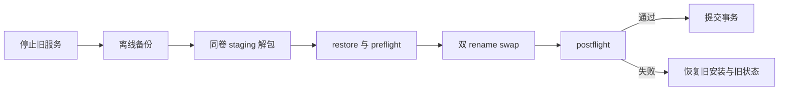

# RayleaBot v0.3 执行计划

本文档定义 v0.3 的正式范围、完成条件和阻塞门槛。已发布版本的能力记录见 [`CHANGELOGS/`](./CHANGELOGS/)。

状态图例：`☑️ 已验证` · `🟡 实施或验证中` · `❌ 外部条件阻塞`

## 正式范围

v0.3 聚焦四条主线：

- 管理治理：权限策略、黑白名单、限流和命令治理共享正式状态与错误语义。
- 插件信任：安装前检查来源、摘要、能力和安装脚本，并要求用户确认可信代码风险。
- 自定义管理页：插件可提供包内 HTML、JavaScript 和 CSS；宿主以受限 iframe 加载页面，正式交互通过版本化 bridge 完成。
- 发布信任与更新：Web、Launcher 和 CLI 共享签名发布元数据、更新状态、校验规则和恢复语义。

以下能力不属于 v0.3：插件市场、插件间依赖解析、插件 OS 强沙盒、多实例高可用和非 OneBot 多协议。第三方插件按完全可信的本地代码管理。

## 阶段总览

| 阶段 | 名称 | 状态 | 完成条件 |
| --- | --- | --- | --- |
| Phase 1 | Governance / Commands | ☑️ | 权限、名单、限流和命令治理使用正式 contract 与服务端状态源 |
| Phase 2 | Trusted Plugin Sources / Custom Management UI | ☑️ | 安装检查、可信代码确认、自定义页面静态路由、bridge 和内置页面验收全部通过 |
| Phase 3 | Release Trust / Automatic Update | ❌ | 可信元数据、更新核心、Windows 事务安装和真实签名 packaged E2E 全部通过 |
| Phase 4 | Companion Updates / Acceptance | 🟡 | contracts、fixtures、generated types、实现、SDK、发布物、测试和文档无漂移 |

## Phase 1 — Governance / Commands

正式治理入口包括：

- `/permission-policy`：超级管理员与默认权限。
- `/access-lists`：用户和群的黑白名单及白名单启用状态。
- `/rate-limits`：命令与外发消息限流、冷却提示。
- `/commands`：生效策略和插件声明命令的只读视图。

服务端负责裁决顺序、持久化和错误语义；Web 不从日志或本地副本推断治理状态。

## Phase 2 — Trusted Plugin Sources / Custom Management UI

### 正式边界

- 插件安装必须先调用检查入口，获得有时效的 inspection id、包摘要、来源、能力和安装脚本摘要。
- 安装请求必须回传 inspection id、包摘要和可信代码确认。
- `local_directory`、`local_zip` 和未验证的 `remote_url` 均属于人工信任来源。
- `management_ui.pages[].entry` 指向插件包内的 HTML 入口，同一插件的管理页入口位于同一静态资源目录。
- 管理页静态资源由 `/plugin-ui/{plugin_id}/...` 只读提供；宿主通过正式 bridge 提供设置、密钥、调度、渲染、协议目标与身份解析以及插件管理动作。
- 未验证来源的插件首次打开管理页必须人工确认；确认记录随插件版本或来源变化失效。

### 完成条件

| 项目 | 状态 | 验收 |
| --- | --- | --- |
| 安装检查与确认 contract | ☑️ | inspection、摘要、确认和错误语义已进入正式 contract |
| 自定义管理页 contract | ☑️ | manifest HTML 入口、静态路由和 bridge 消息已冻结 |
| 内置插件页面 | ☑️ | Fortune 与 Subscription Hub 的自定义页面、资源和 bridge 交互通过 |
| 插件页面交付边界 | ☑️ | 页面资源限制在声明目录内，管理能力通过受保护 API 与正式 bridge 提供 |

## Phase 3 — Release Trust / Automatic Update

### 信任模型

- 更新仓库地址和 Ed25519 公钥注册表编译进更新核心。
- 发布元数据固定为 `release_manifest.v2.json` 和 `release_manifest.v2.sig.json`。
- 签名 envelope 记录原始 manifest SHA-256、主 `key_id` 和最多两个 Ed25519 签名，支持双签轮换。
- 更新器记录已见最高版本和 manifest digest，拒绝降级、旧清单重放和同版本不同摘要。
- 首个可信更新基线必须手动安装；无法验证 v2 清单的客户端只提供手动升级路径。

### 平台策略

| 产物 | 更新方式 | 条件 |
| --- | --- | --- |
| `windows-x64-full` | `automatic` 或 `guided` | 只有 Ed25519、artifact 摘要、协议版本、平台、版本和 Authenticode 全部通过时可使用 `automatic` |
| `linux-x64-full` | `guided` | 校验签名与摘要后引导下载和手动替换 |
| `macos-arm64-full` | `guided` | 校验签名与摘要后引导下载和手动替换 |
| `linux-x64-server` | `guided` 或 `manual` | 按服务端部署文档完成停服、备份、替换和恢复 |

后台每 6 小时检查一次，只展示可用版本。下载和安装必须由用户确认，禁止静默安装。

Windows 正式证书尚未配置时，发布清单必须把 `windows-x64-full` 标记为 `guided`，界面不得开放安装按钮。自签名证书不能满足正式门槛。

### Windows 事务安装

外置 `raylea-updater.exe` 在安装根之外运行，并重新验证 manifest 签名、artifact 摘要、Authenticode signer、平台、版本和归档边界。用户确认后执行以下事务：

事务保留 `config/user.yaml`、`data/**` 和 `plugins/installed/**`。任一 postflight 失败必须回滚并恢复旧服务；回滚失败进入 `rollback_failed`，禁止自动启动。旧版本和离线备份至少保留 7 天，并至少保留到下一次成功升级。

### 状态与入口

- 状态：`disabled | idle | checking | up_to_date | update_available | downloading | ready_to_install | installing | succeeded | failed | rolled_back | rollback_failed`。
- 阶段：`metadata | artifact | backup | extract | preflight | stop | swap | postflight | commit | rollback`。
- Web API：`GET /api/update/status`、`POST /api/update/check`。Web 只查看和检查更新。
- CLI：`version --json`、`update check --json`、`update verify --manifest --signature --artifact`。
- Launcher：承载用户确认和 Windows 安装编排，消费共享更新核心，不维护平行状态。

### 完成定义

| 项目 | 状态 | 完成门槛 |
| --- | --- | --- |
| v2 manifest、签名 envelope、状态与错误 contract | ☑️ | strict contract 和 fixtures 通过 |
| 共享验签、重放防护和下载边界 | ☑️ | 单元测试与故障注入覆盖错误 key、过期、重放、摘要、大小和磁盘不足 |
| 外置 updater 与事务恢复 | ☑️ | 每个 journal 阶段的中断恢复和 postflight 回滚通过 |
| Web、CLI、Launcher 接线 | ☑️ | 三个入口共享状态、错误和可信结果 |
| 正式 Authenticode | ❌ | Launcher、server、updater 使用正式 Windows 证书、SHA-256 和 RFC3161 timestamp，且 `signtool verify /pa /all` 通过 |
| Windows packaged E2E | ❌ | 真实签名 N→N+1 覆盖服务运行、服务停止和强制 postflight 失败回滚 |

Phase 3 只有在正式 Authenticode 与真实签名 Windows packaged E2E 通过后才能标记完成。证书门槛未满足期间，正式发布保持 `guided`。

## Phase 4 — Companion Updates / Acceptance

任何协议、schema、状态、错误码、配置、插件安装、管理页或发布元数据变更都必须同步：

- formal contracts 与 valid/invalid fixtures；
- server、Web、Launcher、CLI 与 SDK；
- generated types、embedded schemas 和 release metadata；
- 风险对应的测试、发布 smoke、恢复 drill 与用户文档。

最终门禁包括 strict contracts、generated drift、目标 Go `-race`、server build 与 binary govulncheck、Web/Launcher typecheck/test/build/E2E、SDK 包验证、四种发布归档检查、doctor、文档链接检查和 `git diff --check`。

## 长期边界

- `contracts/` 是 HTTP、WebSocket、插件协议、schema、错误码、CLI 和 release metadata 的唯一正式来源。
- Server 是在线状态源；Web 和 Launcher 只消费正式接口。
- 更新核心只接受编译进程序的仓库和公钥，`build_info.json` 不能改变信任根。
- 插件完全信任边界、更新发布信任边界和管理会话边界彼此独立。
- 主技术栈维持 Go、Vue、React、Electron 和 SQLite，不引入平行框架或第二状态模型。
