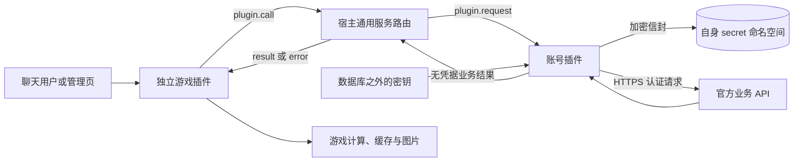

# RayleaBot 三游戏独立插件与统一 CK 管理完整方案

更新日期：2026-09-19。参考快照：2026-09-15。状态：本文是最初的实施方案。2026-09-20 的审计后，后续工作与当前状态以[返工计划](./rework-plan.md)为准，两者冲突时以返工计划为准。

本方案使用宿主通用插件服务调用连接四个独立插件。业务定义留在插件自己的契约与实现中；当前正式能力仍以主仓库契约为准。已确定的范围：所有插件默认可信，仅实施 CK 加密与显示分离；保留全部云功能并优先接入现有服务；先交付国服，海外保留在完整目标；采用 RayleaBot 原生界面和管理方式。本文件描述整体实施目标；通用服务以当前已更新的正式契约为准。

## 1. 结论与目标

交付四个独立插件：原神、崩坏：星穹铁道、绝区零、米游社 CK 管理。各游戏的增强功能直接进入对应游戏插件，不要求用户再安装 ark、逍遥、Atlas 或 Axiu 增强插件。统一 CK 登录由 CK 插件提供，游戏插件获得授权后使用该账号查询业务数据。

采用“凭据代理”：游戏插件只传账号引用、业务操作和参数，CK 插件在内存中解密并代为请求米游社，再返回不含凭据的业务结果。CK/SToken 不交给游戏插件。

四项关键结论：

1. 本次选择先实现宿主通用插件服务调用，再接入四个业务插件。通用层使用 `services`、`plugin.call`、`plugin.request` 及业务无关字段；加密、米游社账号和授权策略全部留在 CK 插件。插件自建本机服务在技术上可行，本次统一采用宿主通道以复用运行状态、请求关联和 SDK。
2. 当前主程序的 secret store 保存原始字节。CK 插件必须在调用 `secret.write` **之前**完成加密，密钥放在数据库之外；不能把现有 secret store 当成已加密保险箱。
3. 沿用所有插件可信的现有模型，只对 CK 凭据加密、限制正式 CK 接口的指定调用者并分离显示。不增加 OS 沙箱、独立服务账号、插件管理页跨源隔离或全局宿主动作权限改造。
4. ark 的全服排名、云面板、UID 跨机器人绑定和 OCR，以及部分 miao 统计，依赖外部服务。已确定保留全部功能并优先接入现有服务；接口授权或可用性未满足的条目保持依赖阻塞。

## 2. 本地参考与证据范围

### 2.1 已下载的主参考

原始 ZIP 与解压源码位于本地 `external/参考项目/2026-09-15/`。本目录保存计划与结构化清单，源码证据使用固定提交的上游链接，不依赖本地参考目录。详见 [参考来源](./references.md) 与 [sources.json](./data/sources.json)。

| 参考 | 固定提交前缀 | 许可文件/仓库标识 | 用途 |
| --- | --- | --- | --- |
| [miao-plugin](https://github.com/yoimiya-kokomi/miao-plugin/blob/7f6f1c84c89102bc6b1c58c8e1b06c61f4642161/README.md) | `7f6f1c84c891` | MIT | 原神/星铁面板、伤害、图鉴、统计与渲染 |
| [StarRail-plugin](https://github.com/TsukinaKasumi/StarRail-plugin/blob/090e411cf9be28b1644721fab54eab0ad283668f/README.md) | `090e411cf9be` | Apache-2.0 | 星铁查询、挑战、模拟宇宙、抽卡和攻略 |
| [ZZZ-Plugin](https://github.com/ZZZure/ZZZ-Plugin/blob/e35d30d52a395eae06d58f41d0ffca1f998b183b/README.md) | `e35d30d52a39` | AGPL-3.0 | 绝区零全部应用模块与发布分支产物 |
| [Yunzai-genshin](https://github.com/TimeRainStarSky/Yunzai-genshin/blob/4a2e1fb8f094b2a8f039ce0768773701718b60b9/README.md) | `4a2e1fb8f094` | 未发现 LICENSE | 基础游戏功能、共享账号/UID、公共查询账号池 |
| [ark-plugin](https://github.com/NotIvny/ark-plugin/blob/b7d8231ddcf606ce4f8d20e9bd743970e4f18cea/README.md) | `b7d8231ddcf6` | MIT；README 另有非商业表述 | 排名、面板增强、OCR、云功能与管理扩展 |
| [Axiu-Plugin](https://github.com/AxiuCN/Axiu-Plugin/blob/6f336229dce0a22344e37107a738717d0860f6b7/README.md) | `6f336229dce0` | GPL-3.0 | 扫码、CK 刷新、签到与抽卡/挑战增强 |
| [xiaoyao-cvs-plugin](https://github.com/ctrlcvs/xiaoyao-cvs-plugin/blob/e7ab3e8b276a11680beb47d0c5517f6e0a4c2022/README.md) | `e7ab3e8b276a` | GPL-3.0 | 扫码原始流程、SToken、图鉴、地图、体力与签到 |
| [Atlas](https://github.com/Nwflower/Atlas/blob/016e49357666e0823791abdf28fbb3b2efe68225/README.md) | `016e49357666` | GPL-3.0 | 图鉴库规则与游戏资料增强 |
| [Miao-Yunzai](https://github.com/yoimiya-kokomi/Miao-Yunzai/blob/40cc2103efba1fbb279b768e3f5345d45372d357/README.md) | `40cc2103efba` | GPL-3.0 | 核对 Yunzai 的共享账号模型与运行时关联 |

额外下载 [ZZZ-Plugin-dev](https://github.com/ZZZure/ZZZ-Plugin/blob/fb66219cec0294e1834bacdf0033b2d43a9ccaf4/README.md) 的 TypeScript 源码，以及 Axiu 固定引用的 [MihoyoBBSTools](https://github.com/Womsxd/MihoyoBBSTools/blob/f062d1fda8fab88fd312a5ca3a89537f6351943b/README.md)、[test_nine](https://github.com/luguoyixiazi/test_nine/blob/a6a53bb46bfd33c419fa503f5a31708462893775/README.md) 两个子模块。版本见 [supplementary-sources.json](./data/sources.json)。子模块单独保存，未改变 Axiu 原始归档内容；dev 与 main 独立固定提交，不宣称两者文件树完全等价。

归档均完成 SHA-256 记录、ZIP 全条目 CRC 校验和路径安全检查。摘要用于本地参考核对，不调整主仓库发布或恢复机制。未安装这些项目的 npm/Python 依赖，未执行上游插件、自动安装器或模型下载脚本。Atlas 图库、额外角色图库、OCR 权重和第三方服务数据不包含在普通源码归档中。

### 2.2 功能探索的可复核产物

- [功能复刻矩阵](./functional-parity.md)：八个插件参考的 106 个顶层应用模块逐项归属。
- [命令与入口清单](./command-inventory.md)：374 个静态命令/事件处理声明，包含表达式、函数和源码行号。
- [command-inventory.json](./data/command-inventory.json)：151 个应用源码文件、函数位置、事件/调度线索与条件别名。
- [parity-matrix.json](./data/parity-matrix.json)：模块归属、交付方式和状态。部分模块已进入实现，尚无模块完成全量复刻验收。

这是一份可用于逐项验收的设计基线。静态声明数不是独立功能数，也不证明动态路由、外部 API、全部模板或游戏数据在运行时可用。完整实现需按第 12 节补齐行为用例和实际运行证据。

## 3. 现有系统与 Yunzai 的差异

### 3.1 Yunzai 如何实现一次登录、多插件共用

Miao-Yunzai 的 `NoteUser` 关联一个聊天用户的多个 `MysUser`，`MysUser` 保存米游社账号和各游戏角色，按游戏选择默认 UID。miao 通过 `e.runtime.getMysInfo` 获得账号；ZZZ 直接复用 genshin 的 `NoteUser` 与 Cookie 获取函数。这依赖同进程对象、数据库/文件及完整 Cookie 的互通。

源码入口：[NoteUser.js](https://github.com/yoimiya-kokomi/Miao-Yunzai/blob/40cc2103efba1fbb279b768e3f5345d45372d357/plugins/genshin/model/mys/NoteUser.js)、[MysUser.js](https://github.com/yoimiya-kokomi/Miao-Yunzai/blob/40cc2103efba1fbb279b768e3f5345d45372d357/plugins/genshin/model/mys/MysUser.js)、[miao MysApi](https://github.com/yoimiya-kokomi/miao-plugin/blob/7f6f1c84c89102bc6b1c58c8e1b06c61f4642161/models/MysApi.js)、[ZZZ plugin.js](https://github.com/ZZZure/ZZZ-Plugin/blob/e35d30d52a395eae06d58f41d0ffca1f998b183b/dist/lib/plugin.js)。

目标保留统一账号、多角色和按游戏选择的体验，使用 CK 代理提供业务数据。游戏插件不共享可变文件、Cookie 池或运行时全局对象。

### 3.2 当前 RayleaBot 的正式边界

| 当前事实 | 来源 | 对方案的影响 |
| --- | --- | --- |
| manifest/protocol 已为 v4，全部宿主动作对可信插件可用，manifest 不再声明宿主 permissions | [plugin-info](../../../contracts/plugin-info.schema.json)、[plugin-protocol](../../../contracts/plugin-protocol.schema.json) | 不照搬旧版权限字段，不重建全局宿主动作权限体系 |
| 插件是完全可信原生代码，没有 OS 沙箱 | [架构说明](../../architecture/README.md) | 沿用现有可信插件模型，按私有命名空间组织数据 |
| secret 动作使用运行时真实 PluginID，读取结果只返回该插件 | [default_registry.go](../../../server/internal/plugins/actions/default_registry.go)、[SDK actions](../../../sdk/go/actions.go) | CK 插件拥有自己的密文命名空间 |
| secret store 是 raw byte blob；旧同库密钥加密已在迁移中移除 | [store.go](../../../server/internal/platform/secrets/sqlite/store.go)、[migration_000003.go](../../../server/internal/storage/migration_000003.go) | 插件侧先加密，主程序只存不透明信封 |
| `plugin.call`、`plugin.request` 和 `services` 随 Core 0.7.0 提供 | [协议](../../../contracts/plugin-protocol.schema.json) | 账号业务通过通用 SDK 接入，仍由独立插件维护 |
| 插件 UI 与管理面同源且被视为可信代码 | [管理页文档](../../plugin/management-ui.md) | 沿用现有加载方式；各插件独立页面展示业务数据，CK 只展示摘要 |

主仓库现有文档个别位置仍有旧版本文案；本方案以 JSON schema 和当前实现为准。本计划不把未发布的服务能力写成当前用法。

## 4. 四插件职责与独立部署

以下名称和 ID 为建议值，实施时写入各自正式 manifest。

| 独立仓库/插件 | 建议 ID | 独占职责 |
| --- | --- | --- |
| 原神 | `raylea.genshin` | 原神业务、原神面板公式/资源、原神增强、游戏调度与管理页 |
| 星穹铁道 | `raylea.starrail` | 星铁业务、星铁面板公式/资源、星铁增强、游戏调度与管理页 |
| 绝区零 | `raylea.zzz` | 绝区零业务、驱动盘/伤害、挑战/排名/提醒、资源与管理页 |
| 米游社账号 | `raylea.mihoyo-accounts` | 扫码、凭据加密、换取/刷新/撤销、账号角色关系、授权和认证请求代理 |

各自有独立 Go module、Vue 管理页 package、manifest、artifact、配置与发布流程；遵循 [当前工程基线](../../engineering/baseline.md)。共享的类型、无状态 API 结构和通用构建工具可通过编译期库复用，不形成第五个必装运行时插件，也不共享可变账号状态。

任意游戏插件可单独安装，公开图鉴、计算、公开 UID 展柜查询和导入的非敏感数据仍可使用。需要米游社认证的功能依赖 CK 插件处于可用且已授权状态。缺失、停用、锁定或协议版本不兼容时给出对应状态，不自动安装或启动其他插件。

已登录账号、验证过的角色、授权与默认游戏角色由 CK 插件单独维护。无 CK 安装时游戏插件可保存“公开查询收藏 UID”；它不等于角色所有权，不能自动升级为有权使用 CK 的绑定。

## 5. 通过通用服务调用共享账号

宿主侧的字段、状态与错误设计统一见[插件协议](../../plugin/protocol.md#插件服务调用)。本节只定义四个业务插件如何使用该能力。



### 5.1 通用层与插件业务层

| 层次 | 内容 | 维护位置 |
| --- | --- | --- |
| 宿主通用调用 | 目标插件、服务、服务版本、方法、参数容器、来源上下文与结果关联 | 宿主插件协议、SDK、路由与生命周期 |
| 账号服务 | 账号引用、角色引用、游戏操作、登录状态、允许调用者及账号用途 | 账号插件的服务契约与实现 |
| 游戏功能 | 游戏规则、伤害与评分、记录分析、资源、排行和提醒 | 各独立游戏插件 |

宿主不得按游戏名、Cookie 类型、账号字段或固定插件 ID 进行分支处理。请求中的业务字段全部放入 `params`，由提供插件解释。

### 5.2 账号服务接口草案

账号插件可在自己的 manifest 中声明 `accounts` 服务，并定义角色摘要查询及业务请求方法。以下为应用侧拟议调用数据，不是宿主内置业务：

```json
{
  "target_plugin_id": "raylea.mihoyo-accounts",
  "service": "accounts",
  "service_version": 1,
  "method": "execute",
  "params": {
    "account_ref": "opaque-account-ref",
    "role_ref": "opaque-role-ref",
    "operation": "genshin.note",
    "input": {}
  }
}
```

这里的插件 ID、`accounts`、`execute` 和 `params` 内所有字段属于插件自己的业务定义。宿主只匹配实际声明，不预置这些标识或参数规则。

账号插件维护固定 operation 与官方端点的映射，确定主机、HTTP 方法、凭据类型、输入/输出结构、缓存和重试政策。游戏插件不提交任意 URL、Cookie、Authorization、SToken 或 AuthKey。

官方返回的新凭据由账号插件消费和加密保存；对外只返回明确结构的业务数据。响应头、登录 tokens、带凭据 URL 和调试对象不原样返回，也不进入图片渲染数据。

### 5.3 账号与指定调用插件

所有插件默认可信。账号插件维护允许调用者列表，并依据宿主附加的 `caller_plugin_id`、原始来源上下文和自己的账号/角色关系执行正常业务校验。管理员指定可接入的游戏插件，账号所有者选择共享用途；该配置不变成宿主全局权限体系。

聊天主体使用 `source_protocol + source_adapter + bot_id + actor_id` 关联。支持同用户多个米游社账号、多游戏角色与默认 UID；跨协议、跨 bot 的绑定要有明确的关联步骤，不能仅比较相同字符串 ID。

角色引用只是标识，不单独授予使用账号的资格。公共查询账号池需所有者主动开启，区分公开查询、个人查询、定时读取和签到/兑换等用途。

定时任务依据用户事先建立的委托执行。宿主传递其实际任务来源，账号插件检查委托对应的调用插件、账号、角色、操作和有效期；退订、停用或删除账号后停止后续使用。

### 5.4 SDK、存储与生命周期

游戏插件使用通用 SDK 发起调用，账号插件在 `plugin.request` 处理上下文中使用现有 `secret.read/write/delete`。该上下文属于账号插件，因此只访问它自己的密文命名空间，不借用游戏插件的存储权限或已经终止的事件。

各游戏只调用账号服务，账号服务不回调游戏，符合通用服务首版的一跳约束。提供者仍可调用现有存储、调度、渲染等普通宿主动作。

目标不可用、版本不匹配、超时、取消和重载按通用计划处理。游戏公开功能可独立使用，需要账号的功能展示准确的不可用原因；不自动启动已停用插件。

本方案采用宿主已有 SQLite secret store 保存加密信封，保留现有备份语义。加密与主密钥均在账号插件内处理，主程序不新增业务账号表、登录页面、全局加密层或插件沙箱。

## 6. CK 加密与显示分离

### 6.1 已确定的范围

所有已安装插件默认可信。保护对象是存入数据库、备份以及正常调用/展示流程中的 CK 及关联登录凭据；不把抵御恶意本地代码、进程内存读取或系统身份冒用纳入交付目标。

“显示分离”采用现有插件页面与数据命名空间：CK 管理页显示脱敏账号、角色、登录/刷新状态和指定调用插件；游戏页显示自己的游戏数据。界面、日志、聊天消息和业务响应不显示原始凭据。沿用现有同源管理页与宿主权限模型，不增加跨源 UI、沙箱或专用系统账号。

保留原需求中的“仅指定插件可以使用 CK”：CK 插件维护允许调用的游戏插件列表，正常服务调用按实际调用插件及账号/角色关系检查。该列表是 CK 功能配置，不是新的全局插件信任系统。

### 6.2 数据库存储

- 使用 AES-256-GCM，在 CK 插件内完成加密后再调用现有 `secret.write`。宿主继续按原有 raw blob 语义保存，主库其他数据和加密范围不变。
- 使用标准库与安全随机数，每次写入使用新的 nonce。AAD 绑定格式版本、账号引用和记录类型，避免错配账号；信封包含版本、key ID、nonce、密文及认证信息。[Go cipher 文档](https://pkg.go.dev/crypto/cipher#NewGCMWithRandomNonce)
- 加密范围包含 CK、SToken v1/v2、LToken、Cookie Token、关联账号字段，以及需要保留的 AuthKey、Game/Cloud Token。短期登录会话优先仅存内存，不写临时明文文件。
- 账号索引与账号密文通过一次批量 `secret.write` 原子保存；索引分页并控制大小。账号 tokens、角色关联与更新时间形成一致快照。
- 账号刷新使用账号级锁，共用索引更新串行化或使用原子快照；避免并发刷新覆盖新登录、删除后恢复旧账号等问题。
- 数据库、WAL、备份和 JSONL 中均只有凭据密文。密文记录可以保留类型和数量等必要元信息，原始 CK 无法由数据库副本本身恢复。

### 6.3 密钥与恢复

随机主密钥保存在数据库之外。Windows 使用当前用户范围 DPAPI 封装 CK 插件自己的主密钥，不创建专用服务账号；这用于保护密钥文件和数据库副本，沿用插件默认可信的前提。[Microsoft DPAPI 文档](https://learn.microsoft.com/en-us/windows/win32/api/dpapi/nf-dpapi-cryptprotectdata)

其他平台使用对应系统凭据设施，或提供口令加密的密钥文件。密钥不写进代码、普通配置或主库，不增加外部 KMS 等必装服务。密钥无法读取时返回明确的锁定/缺失状态，保留密文，不改为明文存储。

同机重启重新解封密钥并恢复账号服务。跨机迁移使用 CK 专用加密导出与独立密钥恢复材料；只复制数据库不保证能在另一台机器解密。密钥轮换在 CK 插件内按记录重加密并保存进度，失败可继续，主程序备份和恢复机制保持现状。

删除账号移除当前凭据并停止后续调用；历史备份仍按其备份时间保存密文。本方案不增加防恶意回放的外部授权计数器或系统状态服务。

### 6.4 调用与显示

游戏插件调用 CK 代理获取业务结果，原始 CK/SToken 不在插件之间传递；通信复用宿主通用调用，无需额外本机服务端口或配对证书系统。CK 插件在内存中解密并请求官方 HTTPS API，官方调用结束后返回经过字段筛选的业务数据。

- 固定官方主机、端点及必要 headers，保持 TLS 证书验证；凭据不随跨主机重定向发送，也不交给云排名、OCR 或图片服务。
- HTTP 日志不记录 Cookie、Authorization、登录 tokens 或带凭据的完整 URL；上游异常、调试输出与管理响应同样不包含这些值。
- CK 页仅显示账号摘要、绑定角色、状态、更新时间和指定插件；游戏页不提供 CK 查看、复制或下载入口。
- `#我的CK` 等命令返回状态摘要；抽卡导出返回无凭据记录，AuthKey 和原始凭据链接由 CK 代理消费。
- 登录使用米游社扫码。需要迁移旧 Cookie 时，CK 插件提供读取指定文件并在内存中加密的导入工具，不经聊天或普通配置传递明文。
- 验证码复用现有浏览器能力，仅保留必要的短期会话，检查其缓存不另存明文凭据；不因此改造主仓库浏览器进程权限。

官方请求构造和登录结果处理会在 CK 进程内短暂使用明文。“不明文传输/存储”针对传输、持久化与展示，不声称运行内存永远不存在原值。

## 7. 米游社扫码登录与 `#刷新CK`

### 7.1 参考实现的实际含义

`Yunzai-genshin/apps/userAdmin.js` 的“刷新用户 CK”进入 `resetCache` / `MysInfo.initCache`，重建缓存和统计；没有完成 SToken 换 Cookie Token。扫码和普通用户 `#刷新ck` 在逍遥与 Axiu 中有明确实现。

当前 Axiu 的 [qrLogin.js](https://github.com/AxiuCN/Axiu-Plugin/blob/6f336229dce0a22344e37107a738717d0860f6b7/model/qrLogin.js) 调用 Passport 创建二维码，轮询 `Scanned` / `Confirmed`，解析 SToken、账号 ID、mid，获取 LToken 和 Cookie Token；[passportApi.js](https://github.com/AxiuCN/Axiu-Plugin/blob/6f336229dce0a22344e37107a738717d0860f6b7/model/mys/passportApi.js) 使用如下路径：

| 步骤 | 源码中的接口路径 |
| --- | --- |
| 创建二维码 | `/account/ma-cn-passport/app/createQRLogin` |
| 查询二维码状态 | `/account/ma-cn-passport/app/queryQRLoginStatus` |
| 获取 LToken | `/account/auth/api/getLTokenBySToken` |
| SToken 换 Cookie Token | `/account/auth/api/getCookieAccountInfoBySToken` |
| 获取绑定角色 | `/binding/api/getUserGameRolesByCookie` |
| 抽卡 AuthKey | `/binding/api/genAuthKey` |

这些是本次源码证据中的非公开客户端接口，不是官方承诺稳定的开放 API。Axiu 还注明旧 host 的 Cookie 交换路径出现过 405；逍遥仓库存在扫码失败反馈。因此不能只复制旧 URL 就宣布可登录。必须用固定版本的认证适配器与真实账号完成验证。[Axiu 源仓库](https://github.com/AxiuCN/Axiu-Plugin)、[逍遥扫码问题](https://github.com/ctrlcvs/xiaoyao-cvs-plugin/issues/177)

### 7.2 目标用户流程

1. 用户发送 `#扫码登录`，或从 CK 管理页开始登录。群内引导到私聊或已认证的个人登录入口，不在群里发布可被旁人扫描绑定的二维码。
2. CK 插件把登录任务绑定到原始用户、入口来源和新的随机会话 ID；同用户重复发起时取消/替换旧任务，旧结果不得覆盖新任务。
3. 代理创建官方二维码，展示二维码与过期时间；ticket、nonce 和官方登录会话只在 CK 进程保存。二维码本身承载短期登录链接，需要限时展示和撤回/失效处理。
4. 用户用米游社 App 扫码并在官方页面确认。代理轮询状态，未知状态不视为成功；超时、取消、重复确认和网络中断均有明确结果。
5. 仅按明确 token 类型解析响应，不采用“未找到目标 token 就拿数组第一个”的宽松降级。SToken v2 所需账号/设备字段完整后再交换 CK。
6. 查询该账号可见的原神、星铁、绝区零角色，并区分游戏、区服和 UID。账号登录成功但某游戏无角色或暂时查询失败时，单独展示该游戏状态并可重试发现。
7. 确认用户绑定意图和指定插件授权，原子加密保存，成功后只返回账号摘要、角色与授权结果。同一米游社账号重复登录更新记录，不制造多份独立 CK。

先完成国服米游社扫码及三游戏闭环；海外 HoYoLAB 已保留在完整目标中，后续实现独立登录、区域端点和兼容验证。国服 CK 不自动登录海外账号。B 服等角色发现以实际账号绑定和上游支持为准，不将任意渠道账号均可扫码导出作为既有事实。

### 7.3 生命周期与刷新

二维码流程可能持续数分钟，不能一直占用原始聊天事件，也不能在事件终态后继续借用其 ActionContext 发消息。创建任务后完成原事件，用短间隔的 `scheduler.trigger` 或有效管理动作驱动轮询；调度载荷只有登录任务引用，短期 ticket 留在内存。完成通知在当前调度事件上下文中发送；进程退出使旧登录任务过期并清理其调度。

凭据是否有效、密钥是否解锁、是否在刷新、是否遭遇验证码分别建模，不把它们挤成一个“登录失败”。`#刷新CK` 刷新发起者已绑定且具备 SToken 的账号，并给出逐账号摘要；权限不足时不能刷新其他人的账号。

同账号刷新采用 singleflight/互斥合并，提交前检查账号代次与撤销状态，保证登出/删除之后迟到刷新不会复活旧账号。定时刷新、手工刷新和普通查询使用一致的令牌快照。

只有端点明确的认证失效代码才触发刷新；没有可用 SToken 或 SToken 已失效则要求重新扫码。超时、网络错误、风控、验证码和 429 保持未知/受限状态，不误删账号。可重试读取在刷新成功后最多重试一次；签到/兑换/订单等有副作用请求先查询结果或使用幂等标识，不能盲目重放。

初版验证重点为国服扫码和换取流程，不实现聊天密码登录。需要旧数据迁移时采用加密导入，保留来源和变更记录。

## 8. 三游戏的完整业务范围

全部逐模块归属见功能矩阵，以下为交付分组。

| 原神 | 必含能力 |
| --- | --- |
| 账号业务 | 角色卡片、探索与成就/宝箱、树脂/派遣/洞天、札记、充值/消费记录、七圣召唤、生日留影 |
| 面板与计算 | 公开展柜与米游社面板、详细属性、天赋命座、圣遗物评分、换装/变换、武器和队伍条件、伤害、练度及群排名 |
| 挑战统计 | 深境螺旋、幻想真境剧诗、幽境危战、历史/分层、持有率/命座/使用率、配队、上传统计、月谕圣牌收藏交换 |
| 抽卡与资料 | 真实记录同步/导入导出、池/角色/版本统计、模拟池保底/定轨、角色武器等图鉴、培养计算、地图定位、活动日历、素材与攻略 |
| 增强与任务 | ark 排名/OCR/云面板、群配置、历史伤害变化；签到、米游币与相关社区任务、云原神签到/状态、公告资讯和到期提醒 |

| 星穹铁道 | 必含能力 |
| --- | --- |
| 账号业务 | 角色卡片、开拓力/委托、月度星琼、充值记录、在线时长估算 |
| 面板与计算 | 角色/光锥/遗器、属性/评分/伤害、miao 面板增强、练度、公开数据源和米游社数据源 |
| 挑战 | 忘却之庭、混沌回忆、虚构叙事、末日幻影、异相仲裁、当前/历史、群排行 |
| 其他玩法 | 模拟宇宙、寰宇蝗灾、黄金与机械、不可知域、差分宇宙与常规/周期演算、货币战争战绩 |
| 抽卡与资料 | 跃迁同步/分析/导入导出、模拟抽卡、角色/光锥图鉴、攻略、星琼预估、参考面板、强度/收益资料、商店光锥、日历和兑换码 |
| 增强与任务 | ark 排名/OCR/云面板、群配置、历史变化；游戏和社区签到、公告/活动与便签提醒 |

| 绝区零 | 必含能力 |
| --- | --- |
| 账号业务 | 绳匠卡片、代理人/邦布、便签、月报/累计统计、区域探索 |
| 面板与计算 | 米游社/Enka 展柜、驱动盘评分、音擎/技能伤害、练度、角色图与原图、别名 |
| 挑战 | 式舆防卫战、危局强袭战、拟境湮灭战、临界推演、拟真鏖战试炼各赛季/历史、群榜及显示隐藏 |
| 特殊玩法 | 零号空洞、枯萎苗圃、迷失之地、迷宫诡域与记录 |
| 抽卡与资料 | 调频同步/分析/导入导出、攻略、技能/意象影画、活动日历、卡池/复刻历史和兑换码 |
| 增强与任务 | 个人/全局挑战提醒、阈值、每日/每周时间、即时检查；设备绑定、资源管理、冷却、更新通知、游戏和社区签到 |

同类功能合并后仍保留来源差异。例如星铁在线时长是依据数据估算；群排名、本实例排名、上游全服排名要标明样本与算法版本。各游戏保持自己的模型与接口，不让一个游戏插件成为另一个的业务依赖。

共用社区任务由游戏插件决定策略，CK 代理对同米游社账号、论坛、业务日、操作做去重与授权检查。CK 插件不承接游戏签到策略、排行榜或攻略。全局混合旧命令建议改成明确的游戏前缀；保留 `#扫码登录`、`#刷新CK` 等账号入口。

## 9. ark 与其他增强的外部依赖

| 功能 | 源码依赖 | 完整交付要求 |
| --- | --- | --- |
| 全服/自定义/百分位/幽境排名、用量 | `ark.ivny.cn`、部分 `akasha.cv` | 上游授权、版本与配额适配；或独立集中排名服务和数据收集体系 |
| 云面板上传、十分钟交换、首刷恢复 | `panel/upload`、`panel/download`、`panel/data` 等 | 受控数据上传、过期与身份验证；本地导入导出保留，但不能代替跨机器人共享 |
| UID 跨机器人验证 | `verify/code`、`verify`、`verify/user` | 游戏签名挑战、超时/唯一性/撤销、上游身份映射 |
| 面板变换/圣遗物重塑重投 OCR | `ocr/profilechange/{gs,sr}` 等 | 上游 OCR 或可分发的本地模型，图片限制、识别置信度和人工更正流程 |
| miao 持有率/使用率/深渊统计 | Hutao/miao、Lelaer、yshelper 等来源 | 保留数据来源、算法、时间、样本与服务不可用状态 |
| 公开面板、图鉴、攻略和活动 | Enka、Mihomo、官方及作者资源库 | 多来源兼容、资源许可、版本和缓存策略 |
| Axiu 签到、验证码、抽卡历史增强 | MihoyoBBSTools、验证码服务、小助手 | 逐项核对真正需要的数据；不允许把 CK/高权限登录结果交给第三方服务 |

ark 的实际代码会在部分面板/验证请求中传 `qq`，OCR 会使用图片 URL；这些字段不能被 README 的概括性“只上传 UID 和面板”替代。首次启用具体云功能时说明发送哪些数据，由用户选择；默认不偷偷上传。非 QQ 协议的 openid 不能冒充 QQ 号提交给只支持 QQ 的 API，必要时标明该上游功能的协议限制。证据：[ark API](https://github.com/NotIvny/ark-plugin/blob/b7d8231ddcf606ce4f8d20e9bd743970e4f18cea/model/api.js)、[ark user.js](https://github.com/NotIvny/ark-plugin/blob/b7d8231ddcf606ce4f8d20e9bd743970e4f18cea/apps/user.js)。

已确定优先接入现有服务：开发各游戏内部的适配器，处理接口版本、token/配额、数据上传范围与失败结果，并验收上游实际允许使用的接口。云功能全部保留在完整目标中。

上游不可用、缺少接口授权或数据条件不满足时，对应条目标记依赖阻塞。接入失败不会自动改成本地功能，也不自动扩展为自建集中后端；保留失败证据和需要解决的接口条件。

## 10. 兼容、素材与代码来源

### 10.1 命令与原生交互

建议标准入口为 `#原神 …`、`#星铁 …`、`#绝区零 …`，分别兼容常用 `#角色面板`、`*…`、`%…` 等已确认别名。同名角色和裸命令有歧义时要求指定游戏；不让三个插件抢占一个会话。

“我的 CK/我的 SToken”改成账号状态摘要；原始抽卡链接导出改成无凭据记录导出；手工明文 CK 绑定改成扫码/加密导入。这些是为了满足本次安全要求而必须记录的兼容差异。

按已确认的原生管理方式，ark 的覆盖 miao 文件、任意文件备份恢复、改其他插件优先级和 Git 分支切换，替换为各游戏内置开关、插件私有业务数据导入导出、明确命令路由与正式 artifact 发布。保留功能结果和必要信息，使用四个独立插件的原生操作入口。

补充参考中的入群审批、代发言、其他米哈游游戏、聊天密码登录、充值下单/支付，与三游戏查询和 CK 管理存在额外边界。矩阵保留它们，实施前决定是否纳入；其中明文密码/CK 传入与本次要求冲突，不按旧方式实现。充值记录查询已经纳入，充值付款流程不能因名字相近而混为一项。

### 10.2 资源与算法

- 按快照数据版本处理全部角色、装备/套装、天赋/命座/星魂、技能倍率、属性转换、反应/击破、敌方防御/抗性和队伍条件；建立可解释的数值向量，保留舍入与百分比单位。
- 面板源各有数据缺失、缓存时间和展柜限制；需要标准化转换器，禁止用缺失值悄悄算成 0 并输出貌似正确的伤害。
- 原神/星铁静态资源很大，本次 miao 和 StarRail ZIP 分别约 388.8 MiB、305.0 MiB，超过当前宿主远程插件下载 256 MiB 限额。将小型核心 artifact、游戏数据和按需资源缓存分开；主程序限额不为参考项目临时放宽。[安装限额源码](../../../server/internal/plugins/lifecycle/install.go)
- 原始仓库里的图片、字体、图鉴和攻略不自动随代码许可证获得再分发许可。资源清单记录作者、来源、版本与用途；可先用自有模板及已授权资源，不把“能够下载”当成“能够发布”。
- 优先使用现有 Go SDK、Vue UI SDK 与渲染能力，渲染数据只含业务 DTO；由服务端缓存获取的敏感图片不能带 CK URL 交给 Chromium 下载。

### 10.3 许可与实现方式

保留上游 LICENSE/NOTICE。miao、StarRail、ZZZ、Axiu、逍遥、Atlas 的许可不同；ark LICENSE 的 MIT 与 README 非商业措辞有张力；Yunzai-genshin 未发现许可证。分发前需逐项目核清源码、模板、字体和素材使用条件，不从仓库公开可读推断可任意移植。

建议以行为规格和测试向量驱动原生实现，减少直接绑定 Yunzai 私有对象；这不是对所有代码和素材权利问题的自动豁免。如选择移植原代码或模板，发布形态与许可安排需一并确定。此项不要求修改 RayleaBot 主仓库许可证。

## 11. 实施顺序与交付门槛

| 阶段 | 交付物 | 必须证明的结果 |
| --- | --- | --- |
| P0 功能台账 | 已确定通用服务调用、可信插件、局部加密、云接入、国服优先和原生界面；补齐命令级用例 | 每项原功能有目标、提供者与接口依赖，未删减项保持在完整目标内 |
| P1 通用服务调用 | 完成通用计划 S1–S4：`services`、`plugin.call`、`plugin.request`、SDK 与运行管理 | 通用示例完成调用；路由不含业务特征字段，超时/取消/重载/并发路径可验证 |
| P2 CK 纵向闭环 | 扫码→换取→加密→角色发现→授权→一次查询→刷新/撤销 | 三个独立测试客户端共用一次登录；数据库和 IPC 无 CK，未授权请求被拒 |
| P3 四插件基础发布 | 独立构建、安装、启停、管理页；三游戏基本查询、图鉴、面板和抽卡 | 每游戏能单独部署，不依赖另外两游戏；缺 CK 的状态正确 |
| P4 全业务补齐 | 原神全部模块、星铁全部挑战/宇宙、ZZZ 全赛季/提醒，计算与数据转换 | 固定快照全部必选行为用例有证据，不以几张成功截图代替完整性 |
| P5 增强与外部依赖 | ark、统计/资料、签到/验证码、云与本地增强 | 外部服务权限和数据条件成立，隐私授权、退订、配额、错误处理通过 |
| P6 海外与发布验收 | 海外登录/端点适配、目标平台 artifact、升级/恢复说明、许可和资源清单 | 国服与海外的最终范围均完成；全新安装、密钥恢复/轮换、重启与撤销可验证 |

P3 是基础可用里程碑，不能作为“全部复刻”完成。国服先交付，海外仍须在最终验收前完成。完整功能量取决于全角色公式/素材和外部 API 条件，先通过首个真实登录闭环再细化工期。每阶段拆成明确的独立提交。

## 12. 验收与验证边界

### 12.1 安全与账号

1. 使用合成 CK/SToken/AuthKey 标记，验证数据库、WAL、备份、日志、JSONL、管理响应、崩溃输出和渲染缓存没有原文；测试不使用真实账号秘密。
2. 同一个密文以错误 key、修改 nonce、篡改 tag 或交换账号/AAD 时拒绝读取；重复加密同一值产生不同密文。
3. 未列入名单的插件、伪造用户、错误角色、跨游戏 operation、过期/撤销授权均拒绝；公共查询账号仅支持所有者开放的用途。
4. 队列中请求在真正发出前再次检查授权代次；撤销后不发送新请求。已发到官方的操作无法保证撤回，应如实报告其状态。
5. 同账号并发刷新只发生一次；删除/重登与刷新竞争不复活旧凭据；重载后旧进程响应不能进入新会话。
6. QR 超时、取消、扫描未确认、重复确认、错误字段、新 token 类型、部分角色发现失败均有案例。
7. 锁定、密钥丢失、服务重启、轮换中断、单库恢复到新机器均有明确且无明文降级的路径。
8. 检查 CK 与游戏页面仅显示各自业务信息，状态/日志/图片不泄露凭据；沿用现有插件运行和管理页模型，不增加系统隔离测试。

### 12.2 游戏与完整性

- 从每项源功能派生业务用例，覆盖正常、无账号、无角色、隐私未开放、分页结束、重复记录、错误区服、风控/限流与上游不可用。
- 抽卡按记录唯一 ID、游戏、区服和池类型去重；验证首拉、增量、全量、历史导入、导出回导和 AuthKey 过期。
- 伤害、圣遗物/遗器/驱动盘评分按固定元数据版本验证基准值、极值、条件和舍入；加入真实多角色结果对照，不测试实现步骤。
- 榜单验证样本来源、隐私/显示开关、并列、分页、过期、版本变更和历史对比；上游全服样本不可用时不输出伪排名。
- 提醒与签到覆盖游戏业务日/区服时区、用户展示时区、每天/每周条件、重启去重、误触发、撤销与延迟；按账号/操作/业务日使用幂等键。
- 图片核查长昵称、多角色/多页、字体缺失、空结果和截图信息完整性；视觉由人工审核，E2E 只验证业务流程。
- 报告 `通过 / 失败 / 外部依赖阻塞 / 用户批准的替代 / 明确排除`；没有结论的必选条目阻止“全部复刻”验收。

### 12.3 本轮实际完成的验证

2026-09-15 已完成参考归档下载、完整性检查、路径校验、固定提交记录、源码静态解析和模块归属。2026-09-18 完成通用服务首版及独立账号插件的扫码、加密、代理和管理页实现；真人扫码、凭据换取、角色发现、刷新和三游戏体力聊天查询通过。其余游戏查询、第三方云权限与完整计算输出仍待验收。下载核验记录不能代替功能验收。

## 13. 已确认决定与附加范围

结构化记录见 [decisions.json](./data/decisions.json)。

| 决定 | 最终选择 |
| --- | --- |
| 插件信任与加密 | 所有插件默认可信，只做 CK 加密和显示分离；保留指定插件正常调用名单；取消恶意插件防御及系统/管理页隔离改造。 |
| 云功能 | 全部保留，优先接入现有服务。 |
| 区服 | 先交付国服，海外仍在完整目标中。 |
| 复刻尺度 | 功能完整，界面、命令组织和管理采用 RayleaBot 原生方式；凭据显示/导出按加密与脱敏要求替换。 |
| 主仓库边界 | 实施业务无关的通用插件服务调用；加密、登录和账号授权留在 CK 插件，不新增全局加密或权限/沙箱体系。 |

补充参考中的其他游戏、充值下单/付款、入群审批和代发言保留为额外功能候选，三游戏与 CK 是当前明确实施目标。三游戏的充值记录查询、签到、面板和云增强均已纳入，不因补充参考含其他功能而扩大或缩减已确定目标。


### ark 授权令牌

ark 令牌属于各游戏插件的外部服务凭据，与米游社 CK 分开。它在游戏管理页经临时公钥加密后进入管理协议，再由游戏插件使用独立密钥 AES-GCM 加密，写入自身数据库 secret 命名空间；仅对固定 ark HTTPS 主机使用。Windows 密钥以 DPAPI 保护，其他平台用口令包装，密钥缺失/锁定时明确失败。共享既有编译期密钥库实现，不增加宿主加密能力或新的运行时插件，不改变现有 CK 密文格式、目录或账号归属。
