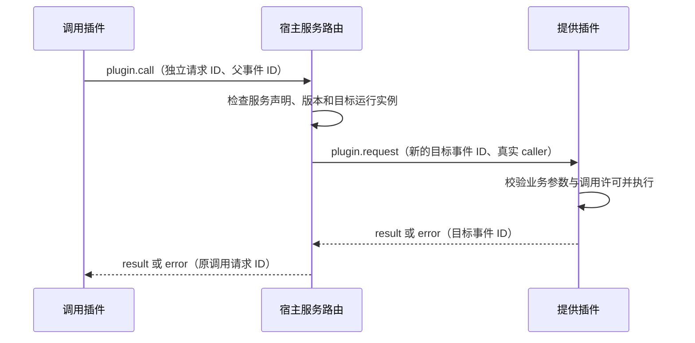

# 通用插件服务调用实施计划

更新日期：2026-09-20。状态：S1–S4 已落实到契约、宿主、Go SDK、文档与两个原生示例并已提交。协议不含取消帧，服务声明不设最低 Core 版本门槛。

## 1. 目标与适用范围

允许插件通过宿主调用其他插件主动公开的服务。宿主复用现有 JSONL 通道和插件生命周期，统一关联请求与响应，处理目标状态、版本匹配、超时、调用方放弃和并发等待。

该能力适用于任意插件组合。调用方、服务名、方法和业务参数均来自插件声明或调用数据，宿主不写入某个业务的专用字段、插件 ID、白名单或处理分支。公开名称保持业务无关且可读，避免随机代号。

现有 [插件协议](../plugin/protocol.md) 已有 `action`、`event`、`result`、`error` 与请求关联；当前 [manifest](../../contracts/plugin-info.schema.json) 和 [协议 schema](../../contracts/plugin-protocol.schema.json) 已定义服务声明与跨插件调用；下述 JSON 展示相关片段。

## 2. 最小交付范围

1. 提供者静态声明服务、版本和公开方法。
2. 调用者显式指定目标插件、服务、版本、方法与参数。
3. 宿主向目标运行实例投递定向请求，将结果或错误关联回调用者。
4. SDK 提供类型化调用与服务处理入口，复用已有请求/结果机制。
5. 明确超时、调用方放弃、停用、重载、并发、调用链与过载行为。

首版通过显式目标插件 ID 路由，不自动选择提供者，不自动安装或启动依赖。服务与普通订阅广播分别投递，不用聊天消息模拟调用，也不开放其他插件的私有存储命名空间。

## 3. 业务无关的名称

| 用途 | 计划名称 | 说明 |
| --- | --- | --- |
| 管理和文档名称 | 插件服务调用 | 表达用途，不绑定服务所属业务 |
| manifest 声明 | `services` | 每个服务有 `name`、`version`、`methods` |
| 调用 action | `plugin.call` | 调用者使用现有 action 封装 |
| 提供者收到的事件 | `plugin.request` | 宿主定向投递，不进入普通 fan-out |
| 目标插件 | `target_plugin_id` | 明确选择已安装插件 |
| 服务、服务版本、方法、参数 | `service`、`service_version`、`method`、`params` | 宿主只处理路由和通用约束 |
| 可信来源信息 | `caller_plugin_id` | 宿主从真实运行会话附加，调用者不填写 |
| 请求关联 | `request_id`、`parent_request_id` | 沿用现有协议名称，分别关联动作与父事件 |
| 返回封装 | `result`、`error` | 复用现有终态模型，不新增业务专用帧 |

例如，提供者声明以下服务片段：

```json
{
  "services": [
    {
      "name": "resource",
      "version": 1,
      "methods": ["query"]
    }
  ]
}
```

调用 action 的业务数据片段：

```json
{
  "target_plugin_id": "provider-a",
  "service": "resource",
  "service_version": 1,
  "method": "query",
  "params": {
    "id": "item-1"
  }
}
```

服务版本与宿主 `protocol_version` 分开演进。首版按服务版本精确匹配，方法必须在该服务版本中公开；不得静默降级到其他版本。服务内的输入/输出结构和业务错误由提供插件自己的契约定义。

## 4. 调用路径与状态归属



- 安装记录和静态服务声明由 Catalog 管理；能否接收请求以当前 Runtime/Lifecycle 的实际状态为准。
- 宿主在内部关联原调用、目标事件、两端运行代次和截止时间，插件不能自行指定运行代次。
- 目标插件继续持有自己业务数据的唯一写入职责。宿主的调用登记只记录通信状态，不复制业务账号、缓存或业务数据库。
- 宿主提供实际 caller 以及可用的原始来源上下文；复用现有事件的来源/主体字段，不把 `params` 中的声明当作宿主认证信息。管理与调度请求可能没有聊天用户，不能伪造一个聊天主体。
- 定时调用由提供插件核对先前建立的业务委托；路由不解释委托代表的业务用途。

所有插件仍视为可信本地代码。宿主不恢复 manifest 全局权限体系；哪些插件、用户或任务可调用某个服务，由提供者按自己的业务配置判断。

## 5. 生命周期、并发与失败语义

| 情形 | 计划行为 |
| --- | --- |
| 目标未安装、停止、启动未完成或不可用 | 立即返回稳定的不可用错误，不自动启动目标 |
| 服务不存在、版本不匹配、方法未公开 | 在投递前返回明确的路由错误 |
| 正常调用 | 只调用声明的方法，返回一个终态；成功终态之后不再发送结果 |
| 调用超时 | 截止时间不超过父事件期限，并包含排队时间；清理关联，迟到结果不再交付 |
| 调用方放弃 | 协议没有取消帧。父事件结束、超时或调用方停止时，宿主结束未完成的调用并不再等待；提供者处理到 `deadline_at_ms`，SDK 让排队中的请求到期后不再执行，迟到终态被宿主忽略 |
| 已经开始的外部副作用 | 调用方放弃或超时不代表回滚；宿主不自动重试业务调用，幂等和结果核对由提供者处理 |
| 任一端停止或重载 | 结束所属运行代次的未完成调用；旧实例迟到响应不得进入新实例 |
| 服务请求再次发起服务调用 | 首版拒绝；保留提供者调用普通宿主动作的能力。直接自调用同样拒绝，避免递归和环路 |
| 并发互调 | 沿用目标插件声明的并发度，禁止持有宿主分发/路由锁等待结果；调用等待不得阻塞 JSONL 读循环 |
| 目标忙或待处理调用过多 | 为新增服务调用定义必要的有界排队与失败行为，复用适用的帧大小/期限限制，不重新建立全局动作权限或通用限流工程 |

服务处理是有父上下文的正常插件执行，提供者可在处理期间使用自己的存储、渲染等宿主动作。SDK 必须等待这些动作结算后发送终态，不能借用已经结束的调用者事件。

首版只支持一跳服务调用。两个独立业务事件并发相互等待时，必须能通过队列拒绝或期限释放，不能永久挂起；不通过偷偷提高插件并发度来掩盖问题。

路由/生命周期错误使用统一错误注册中适用的 code；缺少的类别在契约阶段新增业务无关名称，例如 `plugin.service_unavailable`、`plugin.method_not_found`。业务错误保留来源与提供者定义的语义，实施前明确其与宿主错误目录的分界，不按 message 文案判断。

## 6. 参数、显示与诊断

宿主检查通用封装、路由字段、服务版本和通信资源边界，提供者检查具体业务参数与结果。JSON 的 `params` 不意味着任意宿主动作可被代理执行。

调用日志默认只记录目标插件、服务/版本/方法、请求关联、耗时和稳定错误码，不默认记录请求或响应正文。提供者负责业务内容的脱敏与加密，宿主不需要识别正文中的业务凭据字段。

现有插件管理页加载方式保持不变。首版可在已有插件详情中展示声明的服务摘要和运行可用性；如为此调整 HTTP/WS 投影，先同步对应正式 schema。无需新增独立的管理系统或外部通信端口。

## 7. 实施与配套范围

| 阶段 | 工作 | 验收 |
| --- | --- | --- |
| S1 契约 | 定义 `services`、`plugin.call`、`plugin.request`、来源上下文、版本、期限与错误；确定最小字段及未知值策略 | 有合法、非法和生命周期边界 fixtures，所有名称业务无关 |
| S2 宿主路由 | 接入 Catalog、Runtime 与 Local Action Service，维护调用关联与运行代次 | 未声明方法不投递，停用/重载/超时/调用方放弃无关联泄漏或死锁 |
| S3 SDK | 类型化调用、服务处理注册、上下文与期限；复用已有帧及结果处理 | 两个通用示例插件可完成调用，提供者仍能调用自己的宿主动作 |
| S4 文档与投影 | 更新插件开发文档、示例与确有影响的管理摘要 | 已实现用法和正式契约一致，旧插件不被自动视为服务提供者 |

预期修改面：`contracts/plugin-info.schema.json`、`contracts/plugin-protocol.schema.json`、必要错误登记、SDK 生成类型与实现、Runtime/动作路由、对应 fixtures/examples。管理 HTTP/WS/UI 只按实际展示需求同步。

契约修改先于实现。本次使用 v4 的兼容扩展，不另设最低 Core 版本：清单 schema 禁止未知字段，不支持服务的 Core 会直接拒绝带 `services` 的清单。没有服务声明的插件保持原有运行行为。

## 8. 最小验证

- 两个无业务依赖的示例插件验证成功调用、参数/结果与服务版本匹配。
- 验证不存在的目标/服务/方法、目标停用、超时、调用方放弃、重载和迟到响应。
- 验证默认并发为 1 时的请求处理、提供者内部宿主动作，以及两个插件同时互调的退出路径。
- 验证自调用和服务处理中的再次调用被拒绝，调用队列和帧大小超限有稳定结果。
- 验证 caller 由实际运行会话提供，提供插件可按其名单接受或拒绝调用；不扩展为 OS 沙箱测试。
- 验证通用路由不默认记录正文，正常日志仍足以定位请求和失败。
- 实施后按 [质量门禁](../engineering/quality-gates.md) 运行受影响契约、生成器、Server/SDK 与示例测试；当前文档变更只运行文档检查。
