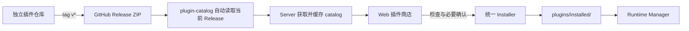

# 插件商店与独立开发

本文说明 RayleaBot 插件商店、独立插件仓库、发布产物和本地联调边界。正式字段以 `contracts/` 中的 manifest、artifact、catalog、Web API 与 CLI 合同为准。

## 设计边界

- 主仓库不内置业务插件源码或产物。插件由独立仓库测试、构建并发布。
- Server 是目录读取、安装包下载、检查、安装和来源记录的唯一入口；Web 不直连目录或安装包，目录声明的 HTTPS 图标可由浏览器直接展示。
- 官方插件源默认存在且不能删除。管理员可以添加、修改和删除自定义 HTTPS 插件源。
- 所有来源复用同一套安装器，并统一安装到 `plugins/installed/<plugin_id>/`。
- 生产运行期只使用预编译原生后端和静态管理页，不编译源码、不安装语言依赖、不执行安装脚本。
- 插件是当前系统用户下运行的本地原生代码。宿主权限声明限制 RayleaBot action，不构成操作系统沙盒。

## 仓库与交付物

| 仓库 | 交付物 |
| --- | --- |
| `RayleaBot/RayleaBot` | Server、Web、Launcher、contracts、SDK、安装器和商店客户端 |
| `RayleaBot/plugin-catalog` | 默认官方源的 `sources.json`、自动同步脚本和 `catalog.json` |
| 各插件仓库 | `info.json`、插件源码、测试和当前支持平台的 GitHub Release ZIP |

插件 ID 是跨仓库稳定身份。catalog 条目 ID 必须与安装包内 `info.json.id` 一致。主仓库 `examples/plugins/` 只用于 SDK 示例，不进入商店或正式发布。

## 数据流



## 插件源与缓存

默认官方源固定为 `RayleaBot/plugin-catalog`。自定义源由管理员提供名称和 HTTPS `catalog.json` 地址。Server 为每个来源持久化最近一次成功读取的原始目录和刷新时间：

- 刷新成功时原子替换该来源缓存；
- 网络、HTTP、解析或合同校验失败时保留上次成功缓存；
- 从未成功读取的来源显示为空，不伪造内嵌条目；
- 删除自定义来源时一并删除它的缓存，已安装插件及其来源记录不受影响。

来源 ID 会写入安装元数据。来自默认官方源的插件显示为官方，其他目录显示为社区来源；开发同步显示为开发中；本地目录、ZIP 和远程 ZIP 显示为未验证来源。显示角色用于溯源，不代表代码安全等级。

## catalog v2

目录只描述每个插件的当前发布状态：

- 插件 ID、名称、摘要、发布者、仓库、许可证、关键词、推荐状态，可选分类和图标；
- 可选的当前版本、发布时间、最低核心版本；
- 一个或多个平台资产，每项只含平台、HTTPS 下载地址和归档 SHA-256。

catalog 不复制历史 Release，不维护撤回状态、资产大小、manifest 摘要、逐文件摘要或目录签名。当前版本没有当前平台资产，或最低核心版本不兼容时，商店保留条目但禁用安装。

## artifact v2 与安装检查

`artifact.json` 只包含：

```json
{
  "artifact_version": "2",
  "target_platform": "windows-x64",
  "entry": "bin/raylea.echo.exe"
}
```

安装器从 ZIP 或展开目录扫描真实内容，而不是信任包内清单。检查内容包括路径逃逸、符号链接、大小写冲突、资源上限、必需文件、原生入口、目标平台、二进制格式和可选管理页入口。商店下载额外核对 catalog 中唯一保留的归档 SHA-256。

检查通过后，Server 返回短期 inspection，Web 展示插件身份、版本、来源、平台和实际权限。以下情况要求管理员确认本地原生代码风险：

- 首次安装；
- 安装来源变化；
- 新版本扩大权限。

同一来源且权限未扩大的更新直接提交安装任务。手动目录、ZIP 和远程 ZIP 始终经过检查与确认。确认请求只提交 inspection ID、检查时的包 SHA-256 与确认状态，不重复提交来源或插件身份。

安装使用同卷 staging 和原子替换。更新保留原 desired state；任一步失败时恢复旧目录、安装元数据、模板和运行状态。

## 商店 API 与界面

主要接口：

- `GET /api/plugin-store/sources`
- `POST /api/plugin-store/sources`
- `PUT /api/plugin-store/sources/{source_id}`
- `DELETE /api/plugin-store/sources/{source_id}`
- `POST /api/plugin-store/sources/{source_id}/refresh`
- `GET /api/plugin-store/plugins?source_id=...`
- `GET /api/plugin-store/plugins/{plugin_id}?source_id=...`
- `POST /api/plugin-store/plugins/{plugin_id}/inspect`
- `POST /api/plugin-store/plugins/{plugin_id}/install`

Web 路由 `/plugins/store` 提供来源切换和管理、手动刷新、搜索排序、分类与图标、安装状态、检查确认和可直接执行的批量更新。详情 API 暂时保留，当前 Web 不增加单独详情页。

页面打开时会在保留现有结果的同时后台刷新当前来源；刷新失败继续显示最后成功目录，不切换到错误页。

## 官方目录自动生成

`RayleaBot/plugin-catalog` 的 `sources.json` 维护稳定展示信息。工作流定时读取每个插件最新的 GitHub Release，只接受名称符合 `<plugin-id>-<version>-<platform>.zip` 且内部 manifest、artifact 和平台一致的包，计算归档 SHA-256 后重建 `catalog.json`。

没有兼容 artifact v2 Release 的插件只发布条目元数据。目录发布不需要私钥、公钥注入、签名提交或人工复制资产摘要。

## 独立插件发布

插件仓库使用正式 SDK tag。推送 `v*` tag 后，工作流为实际支持的平台生成单根目录 ZIP 并发布到插件自己的 GitHub Release。核心仓库 release workflow 不 checkout、不构建、不打包业务插件。

推荐验证：

- Go 插件执行 `go test -race ./...`；
- 有 Vue 管理页时执行 frozen install、typecheck、Vitest 和 Vite build；
- 使用 `raylea-plugin build-go` 或 `raylea-plugin pack` 构建并检查 artifact；
- Release ZIP 名称与插件 ID、版本和平台一致。

发布顺序为：先发布核心 contracts 与 SDK，再更新插件依赖并发布插件 Release，最后由官方 catalog 工作流自动收录。自定义插件源可以采用相同 catalog v2 格式独立发布。

## 本地同步开发

开发者在主仓库根目录复制 `plugin-workspace.example.json` 为被 Git 忽略的 `plugin-workspace.local.json`：

```json
{
  "workspace_version": "2",
  "plugins": [
    {"path": "../RayleaBotPlugins/plugin-echo"},
    {"path": "../RayleaBotPlugins/plugin-fortune", "enabled": true}
  ]
}
```

`RAYLEA_PLUGIN_DEV` 支持：

| 值 | 行为 |
| --- | --- |
| `off` | 不读取开发工作区 |
| `sync` | 启动时构建并同步一次 |
| `watch` | 首次同步后监听插件变更；同时要求 `RAYLEA_SERVER_RELOAD=watch` |

本地联调通过临时 `go.work` 连接主仓库 Go SDK，通过 `.rayleabot/sdk/vue` 镜像 Vue SDK，不改写插件仓库的 `go.mod` 或 lockfile。Server watcher 通过 `POST /api/development/plugins/sync` 在线同步，并查询对应安装任务。该接口要求启动时显式设置 `RAYLEA_DEV_ARTIFACT_ROOT`、直接 loopback 请求和 Launcher control token，拒绝 Origin 与转发头，artifact 路径须在指定目录内。

停服环境也可以使用：

```text
raylea-server plugin dev-sync --artifact <expanded-artifact> --source <plugin-repo>
```

两种入口复用正式 inspect、accept、原子替换和 package metadata 流程，把来源记录为 `development`。相同来源和安装内容直接跳过，已有插件保留 desired state，新插件启用。在线同步等待插件初始化，失败时恢复旧产物与运行时。增量缓存、监听范围和环境复用说明见[本地启动](../dev/README.md#增量构建与环境复用)。

## 防偏移规则

| 语义 | 唯一正式来源 |
| --- | --- |
| manifest 与 artifact | `contracts/plugin-info.schema.json`、`contracts/plugin-artifact.schema.json` |
| 商店目录 | `contracts/plugin-store-catalog.schema.json` |
| 本地开发工作区 | `contracts/plugin-development-workspace.schema.json` |
| 商店 HTTP 与错误码 | `contracts/web-api.openapi.yaml`、`contracts/error-codes.yaml` |
| 开发 CLI | `contracts/cli-commands.yaml` |
| 安装状态与来源元数据 | Server repository、migration 与 catalog 视图 |

评审相关变更时应确认 Web 未绕过 Server 读取目录或安装包，目录失败不会清空缓存，manifest 不能自报官方身份，安装仍经过 inspection，更新失败保留旧产物，开发流未直接运行源码目录，核心发布包不含业务插件，并且 contracts、fixtures、嵌入 schema、生成类型、实现、测试和本文同步更新。

## 相关文档

- [Plugin Lifecycle](./lifecycle.md)
- [Plugin SDK](./sdk/README.md)
- [Management UI](./management-ui.md)
- [Engineering Baseline](../engineering/baseline.md)
- [Repository Workflow](../dev/repo-workflow.md)
- [Delivery and Upgrade](../release/delivery-and-upgrade.md)
