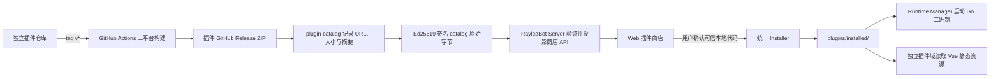

# 插件商店与独立开发

本文冻结 RayleaBot 插件商店、独立插件仓库、发布产物和本地联调的正式边界。插件 manifest、artifact、商店目录、开发工作区、HTTP API 与错误码仍分别以 `contracts/` 下的正式契约为准。

## 核心约束

- RayleaBot 主仓库没有内置插件源码、内置插件产物或内置插件发现目录。
- 所有插件统一安装到 `plugins/installed/<plugin_id>/`，商店安装、本地 artifact 安装和开发同步复用同一套校验与原子替换逻辑。
- 生产运行期只读取预编译 Go 后端和 Vue 静态资源，不编译插件、不执行安装脚本、不安装插件依赖。
- 主程序发布包不携带任何业务插件。插件仓库自行测试、构建三平台 ZIP 并创建 GitHub Release。
- 商店使用经过 Ed25519 验证的静态目录。官方身份、发布者验证状态、下载地址和摘要只来自已验证目录及安装元数据，不能由插件 manifest 自行声明。
- 本地开发插件同样先构建完整 artifact，再通过离线 `plugin dev-sync` 安装；框架不增加第二套“直接运行源码目录”的运行模型。

## 仓库与所有权

| 仓库 | 所有权与交付物 |
| --- | --- |
| `RayleaBot/RayleaBot` | Server、Web、Launcher、contracts、Go/Vue SDK、插件安装器和商店客户端；不发布业务插件 |
| `RayleaBot/plugin-catalog` | `catalog.json` 与 `catalog.sig.json`；维护商店条目、版本、三平台资产及其摘要 |
| `RayleaBot/plugin-echo` | `raylea.echo` 的 Go 源码、测试、构建入口和三平台 Release |
| `RayleaBot/plugin-fortune` | `raylea.fortune` 的 Go 后端、Vue 管理页和三平台 Release |
| `RayleaBot/plugin-game-guide` | `raylea.game-guide` 的 Go 后端、数据、渲染模板和三平台 Release |
| `RayleaBot/plugin-subscription-hub` | `raylea.subscription-hub` 的 Go 后端、Vue 管理页、渲染模板和三平台 Release |

插件 ID 是跨仓库稳定身份。仓库名、Go module、catalog 条目、`info.json.id` 与 `artifact.json.plugin_id` 必须一致。主仓库中的 `examples/plugins/` 只用于 SDK 示例，不进入发现、商店或发布流程。

## 生产数据流



Web 不直接请求 GitHub、商店目录或插件下载地址。Web 只访问 Server 的 `/api/plugin-store/**`；目录刷新、签名验证、平台选择、下载和安装均由 Server 完成。

## 商店目录与信任

### 目录内容

`plugin-store-catalog` v1 为每个插件维护：

- 稳定插件 ID、名称、说明、许可证、关键词和仓库地址；
- 发布者 ID、显示名和 `verified` 状态；
- 可推荐状态；
- 每个版本的发布时间、最低核心版本、撤回状态；
- 每个平台 ZIP 的 HTTPS 地址、字节数、归档 SHA-256 和 manifest SHA-256。

同一插件 ID、版本或版本内平台不能重复。生产目录资产只能使用 HTTPS。当前平台没有可用资产、版本被撤回或核心版本不足时，商店展示不可安装状态。

### 签名与回退

- Server 对 `catalog.json` 的原始字节计算 SHA-256，并用 `catalog.sig.json` 中的一至两个 Ed25519 签名验证相同字节。
- 公钥注册表最多同时携带两个密钥，用于无中断轮换。目录 URL 或可变的本地配置不能替换信任根。
- 正式发行二进制在构建时注入受信公钥；普通本地开发构建没有远程目录信任键，只展示 bootstrap catalog，并通过单元测试或显式带签名键的开发构建验证远程刷新。
- 同一进程内拒绝早于最后已验证快照的 `generated_at`，也拒绝同一时间戳对应不同正文，避免刷新链路接受已知回退或歧义目录。
- 远程刷新失败、目录无效或签名失败时，Server 在当前进程内保留最后一个已验证快照；进程重启后从应用签名覆盖的 bootstrap catalog 重新开始。
- 应用内嵌的 bootstrap catalog 由主程序发布签名覆盖，用于首次启动和远程目录不可用时展示四个官方插件。bootstrap 条目没有 release 时显示为“尚未发布”，不会伪造可安装资产。
- `official` 角色只授予通过已验证 catalog 安装且 `publisher_verified=true` 的包；`development` 只授予开发同步来源；其余本地可信包投影为 `community`。

插件自身的 `info.json` 不包含 `role`，不能修改官方身份、发布者信息或目录摘要。

## 商店 API 与界面

正式入口为：

- `GET /api/plugin-store/plugins`：搜索、发布者过滤、排序和游标分页；
- `GET /api/plugin-store/plugins/{plugin_id}`：条目、版本和当前平台可用性；
- `POST /api/plugin-store/plugins/{plugin_id}/install`：安装指定版本或最新兼容版本；
- `POST /api/plugin-store/refresh`：主动获取并验证远程目录。

Web 路由 `/plugins/store` 展示目录验证来源、搜索排序、仓库链接、已安装版本、可更新状态和安装状态。任何安装或更新都必须经过“插件是本机原生代码”的显式确认；Web 不把确认状态持久化为全局豁免。

页面首次读取到 bootstrap catalog 时会静默请求一次远程刷新；失败时继续展示已验证的 bootstrap 条目，并保留手动刷新入口。

## 安装、更新与回滚

商店安装先冻结已验证目录中的插件身份、发布者身份、catalog 摘要、归档摘要和 manifest 摘要，再进入统一安装器：

1. 下载或读取 ZIP/展开目录，并限制体积、文件数、路径和压缩比。
2. 校验 `plugin-info` v2、`plugin-artifact` v1、目标平台、二进制格式、Unix executable bit、UI 入口、文件全集、大小和 SHA-256。
3. 对商店来源额外核对归档 SHA-256、manifest SHA-256、插件 ID 和版本。
4. 将候选包放入同卷 staging；更新时保留旧目录和旧安装元数据。
5. 原子替换 `plugins/installed/<plugin_id>/`，刷新 catalog、渲染模板和运行期状态。
6. 任一步失败时恢复旧目录、旧 package metadata、旧模板及原 desired state，并继续使用上一个可用产物。

新安装默认保持禁用，由管理员在插件列表中启用。更新保留原 desired state；原先运行的插件在成功替换后恢复运行。卸载不区分官方或社区插件，统一走后台任务和数据保留选项。

## 独立插件发布

每个插件仓库拥有独立 `go.mod`、`info.json`、`tools/build` 和 GitHub Actions。Go 后端入口位于 `cmd/<plugin>/`，插件实现与嵌入资源位于 `internal/`；UI、模板和构建工具保持独立顶层目录。Go SDK 使用正式 tag，例如 `sdk/go/v0.3.0`；Vue 插件在 CI 中从相同核心 SDK 引用复制 `sdk/vue`，避免 Go 与 bridge contract 版本错配。

插件 PR 和主分支执行：

- `go test -race ./...`；
- 存在 Vue 管理页时执行 frozen install、typecheck、Vitest 和 Vite build；
- artifact 构建器校验 manifest，并生成 notices、SPDX SBOM、`artifact.json` 和确定性 ZIP。

推送 `v*` tag 后，仓库分别构建 `windows-x64`、`linux-x64` 和 `macos-arm64`，再将三个 ZIP 发布到该插件自己的 GitHub Release。核心仓库 release workflow 不 checkout、不构建、也不打包这些业务插件。

插件 Release 完成后，catalog 维护者记录实际资产大小、归档 SHA-256 与各包内 `info.json` SHA-256，更新 `generated_at`，通过评审后由 catalog 工作流签名并提交 `catalog.sig.json`。目录不得引用 Actions 临时 artifact 或 GitHub 自动生成的源码压缩包。

首次上线按以下依赖顺序完成：

1. 合并核心 contracts、Go/Vue SDK、商店客户端和安装器，并发布插件仓库引用的 SDK tag。
2. 创建独立插件远程仓库，配置 Actions 权限，并推送已经固定 SDK 引用的源码。
3. 分别推送插件 `v*` tag，由插件仓库发布三平台 ZIP。
4. 将真实 Release URL、字节数和两个摘要写入 catalog，经评审后生成签名文件。
5. 发布包含相应受信公钥的核心版本；商店页面自动刷新后才把条目从“尚未发布”切换为可安装。

本地同步开发不依赖上述发布顺序，也不读取 GitHub Release；只有生产分发依赖正式 SDK tag、插件 Release、签名 catalog 和包含对应公钥的核心版本。

## 本地同步开发

### 工作区文件

开发者在主仓库根目录复制 `plugin-workspace.example.json` 为被 Git 忽略的 `plugin-workspace.local.json`：

```json
{
  "workspace_version": "1",
  "plugins": [
    {
      "id": "raylea.echo",
      "path": "../RayleaBotPlugins/plugin-echo"
    },
    {
      "id": "raylea.fortune",
      "path": "../RayleaBotPlugins/plugin-fortune",
      "enabled": true
    }
  ]
}
```

路径相对工作区文件解析；`enabled: false` 的仓库不参与本次启动。插件 ID 不能重复，artifact 内的 ID 必须与工作区声明一致。可用 `RAYLEA_PLUGIN_WORKSPACE` 指向另一份本地文件。

### 启动模式

`RAYLEA_PLUGIN_DEV` 支持：

| 值 | 行为 |
| --- | --- |
| `off` | 不读取工作区，不构建或同步开发插件 |
| `sync` | 启动 Server 前构建并同步一次；存在本地工作区且未显式设置时的默认值 |
| `watch` | 首次全量同步后监听插件仓库，后续按变更插件增量同步；必须同时设置 `RAYLEA_SERVER_RELOAD=watch` |

没有 `plugin-workspace.local.json` 且未设置环境变量时默认 `off`，所以普通主仓库开发不依赖任何相邻插件仓库。

Windows PowerShell 的完整联调入口为：

```powershell
$env:RAYLEA_PLUGIN_DEV = "watch"
$env:RAYLEA_SERVER_RELOAD = "watch"
.\start.bat
```

只需启动前同步一次时：

```powershell
$env:RAYLEA_PLUGIN_DEV = "sync"
.\start.bat
```

### 同步算法

首次启动或 `sync` 模式下，启动脚本对每个启用的开发仓库执行：

1. 在 `.tmp/plugin-dev/go.work` 临时连接主仓库 `sdk/go` 与所有插件 module，并按各插件 `go.mod` 声明的 SDK 版本写入临时、版本限定的 `replace`；不改写插件 `go.mod`。
2. 若存在 Vue UI，将主仓库 `sdk/vue` 镜像到插件忽略目录 `.rayleabot/sdk/vue`，与插件的 `workspace:*` lockfile 对齐。
3. 调用插件自己的 `go run ./tools/build -target <当前平台>`，得到与生产相同的完整 artifact。
4. 在 Server 未运行时调用离线 CLI：

   ```text
   raylea-server plugin dev-sync --artifact <expanded-artifact> --source <plugin-repo> --plugin-id <id>
   ```

5. CLI 打开同一状态库，执行 inspect/accept、原子替换和 package metadata 写入，将来源记录为 `development`，并把该开发插件设为启用。
6. Server 启动后只从 `plugins/installed/` 发现和运行新产物。

`watch` 模式忽略 `.git`、`.rayleabot`、`dist` 和 `node_modules`。首次启动仍同步全部启用插件；后续变更以插件 ID 为粒度去重并按 500ms 窗口合并，只构建和同步本批发生变化的插件。两个插件在同一窗口内变化时只处理这两个插件；构建期间到达的变更保留到下一批，不会被当前批次覆盖。Server 源码和插件源码同时变化时，启动器在同一批中完成 Server 构建，只停止并重启 Server 一次。

构建、校验或同步失败时，候选产物不会替换现有包，启动器使用 `plugins/installed/` 中的上一个可用 artifact 恢复 Server。本地路径不会请求 GitHub、Actions 或 Release；GitHub Actions 只为插件 `v*` tag 构建正式三平台发布包。

这种路径同时满足快速联调和生产一致性：开发者不必等待 GitHub Release，但每次运行的仍是经过正式 artifact 校验与安装事务的 Go + Vue 产物。

## SDK 同步策略

- 生产发布只使用插件仓库声明的正式 SDK tag，不使用分支浮动引用或主仓库本地路径。
- 本地联调只通过 `.tmp/plugin-dev/go.work` 中的版本限定 `replace` 和 `.rayleabot/sdk/vue` 覆盖 SDK 来源，不向插件仓库提交本机路径、临时 workspace 或镜像 SDK。
- 修改插件协议、manifest、artifact 或 bridge 时，主仓库先更新 contracts、SDK 与正式 tag；插件仓库再更新依赖和 lockfile。
- 只修改某个插件业务逻辑时，不需要发布新的核心 SDK。
- 插件和核心必须分别通过各自 CI；核心 CI 只验证 SDK、示例、安装器、商店和测试 fixture，不承担业务插件发布。

## 防偏移规则

| 语义 | 唯一正式来源 |
| --- | --- |
| manifest 与 artifact | `contracts/plugin-info.schema.json`、`contracts/plugin-artifact.schema.json` |
| 商店目录与签名 | `contracts/plugin-store-catalog.schema.json`、`contracts/plugin-store-signature.schema.json` |
| 本地开发工作区 | `contracts/plugin-development-workspace.schema.json` |
| 商店 HTTP 与错误码 | `contracts/web-api.openapi.yaml`、`contracts/error-codes.yaml` |
| 开发 CLI | `contracts/cli-commands.yaml` |
| 安装状态与来源元数据 | Server repository、正式 migration 与 catalog 投影 |
| 插件二进制及 UI | 独立插件 GitHub Release 中的单根目录 ZIP |

评审任何相关变更时必须确认：

- 主仓库没有重新引入 `plugins/builtin/`、业务插件源码或业务插件 release 构建矩阵；
- 默认 discovery 只有 `plugins/installed/`；
- Web 没有绕过 Server 直连 catalog、GitHub 资产或插件 API；
- 官方身份不能由 manifest、目录名或仓库名自行获得；
- 商店安装仍要求用户确认，并冻结已验证目录摘要；
- 更新失败保留上一个可用目录、元数据、模板和 desired state；
- 开发启动没有直接运行源码目录，也没有改写受控的 `go.mod`、lockfile 或 SDK；
- 插件仓库发布三平台 artifact，核心发布包不含插件文件；
- contracts、fixtures、embedded schemas、generated types、实现、测试和本文同步更新。

## 相关文档

- [Plugin Lifecycle](./lifecycle.md)
- [Plugin SDK](./sdk/README.md)
- [Management UI](./management-ui.md)
- [Engineering Baseline](../engineering/baseline.md)
- [Repository Workflow](../dev/repo-workflow.md)
- [Delivery and Upgrade](../release/delivery-and-upgrade.md)
